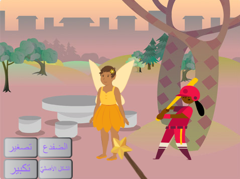

## المقدمة

قم بإنشاء برنامج حيث تستخدم به عصا سحرية لتحويل الكائنات الحية إلى ضفادع تكبر وتتقلص.

سوف تقوم بمايلي:
+ إنشاء أزرار تقوم بعمليّة `بثّ`{:class="block3events"} الرسائل إلى باقي الكائنات.
+ إنشاء عدّة كائنات لتتفاعل مع نفس الرسائل الّتي `تستلمها`{:class="block3events"}.
+ استعمال قائمة `الأصوات`{:class="block3sound"} لعكس الأصوات.

**بثّ** و**استلام** الرسائل هو كنمط النداء والرد في الموسيقى.
 
 
 "P3T3 P3T3 هي أغنية تقليديّة من غانا، غرب إفريقيا. يتمّ إجراؤها بواسطة شخص قائد واحد ينادي، وعلى الجانب الآخر مجموعة أخرى تستجيب له بالردّ بكلمات رئيسيّة، عندما يسمعون النداء." - Kwame Bakoji-Hume, African Activities CIC

<audio controls><source src="images/Pete-Pete.mp3" type="audio/wav"></audio>  

--- no-print ---
--- task ---

### جربها

  
استعمل العصا السحريّة للنقر على الأزرار وإلقاء التعويذات. ما الّذي تقوم به كلّ تعويذة على الشخصيّات؟

  <iframe allowtransparency="true" width="485" height="402" src="https://scratch.mit.edu/projects/embed/659611627/?autostart=false" frameborder="0"></iframe>

--- /task ---
--- /no-print ---

--- print-only ---

--- /print-only ---
