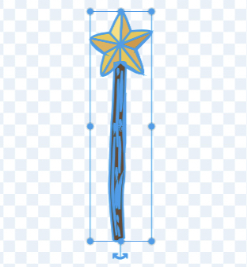

## اختر العصا الخاصة بك

<div style="display: flex; flex-wrap: wrap">
<div style="flex-basis: 200px; flex-grow: 1; margin-right: 15px;">
في هذه الخطوة ستقوم بإعداد المشهد، واختيار العصا الخاصّة بك، وإنشاء السحر الموُلَّد عن طريق الكمبيوتر الخاصّ بك.
  
</div>
<div>
{:width="300px"}
</div>
</div>

<p style="border-left: solid; border-width:10px; border-color: #0faeb0; background-color: aliceblue; padding: 10px;">
<span style="color: #0faeb0">**الصور المُوَلَّدة عن طريق الحاسوب (CGI)**</span> يمكن أن تُستخدم لإنشاء تأثيرات خاصّة لا تحدث في العالم الواقعي. يتضمّن صنع فلم أو رسوم متحرّكة خياليّة تتضمّن العديد من الأكواد وفنون الكمبيوتر.
</p>

--- task ---

افتح [مشروع البداية لبث تعاويذ سحرية](https://scratch.mit.edu/projects/660083015/editor){:target="_blank"}. سيتم فتح Scratch في علامة تبويب متصفح أخرى.

[[[working-offline]]]

--- /task ---

--- task ---

يجب أن ترى جنّيّة في الغابة.


--- /task ---

أنت بحاجة إلى عصًا لإلقاء تعويذة.

--- task ---

انقر على **اختيار كائن**، ثمّ اكتب `wand` (عصا)، في مربّع البحث:


**اختر** أضف العصا الّتي تفضّلها إلى مشروعك.

--- /task ---

--- task ---

أضف مقطعًا برمجيًّا لجعل كائن **Wand** (العصا) يتبع `مؤشّر الماوس`{:class="block3motion"} ،وابقَ `أمام`{:class="block3looks"} الأزرار:


```blocks3
when flag clicked
forever
go to (mouse-pointer v) //غيّرها من "موضع عشوائي"     
go to [front v] layer // أمام الأزرار
end
```

--- /task ---

--- task ---

**اختبار** اضغط على العلم الأخضر لتشغيل المشروع. ستتبع العصا مؤشّر الماوس.

--- /task ---

اجعل العصا أكبر ومائلة، كما لو أنّك تستخدمها حقًّا.

--- task ---

انتقل إلى قائمة الكائنات وغيّر خاصّيّة **الحجم** إلى `200` لجعل العصا أكبر:


--- /task ---

--- task ---

انقر على قسم **المظاهر** لفتح خواصّ العصا في محرّر الرسم.

اضغط على أداة **تحديد** (السهم)، ثمّ ارسم مستطيلًا حول العصا بأكملها، لتحديد كلّ أجزاء الشكل.




ثمّ اضغط على أيقونة **تجميع** لدمج أجزاء العصا.


--- /task ---

--- task ---

استعمل أداة **التدوير** على العصا، لجعل العصا مائلة.


**تلميح:** إذا لم تستطع رؤية أداة **التدوير**، اضغط على أداة **التصغير** (-) الموجودة أسفل محرّر الرسم، لتصغير الشكل.

--- /task ---

شكل **Wand** (العصا) يقف في طريق مؤشّر الفأرة عندما تحاول النقر على الأزرار.

--- task ---

حرّك العصا بحيث يكون طرفها العلوي متطابقًا مع دائرة المركز الصغيرة.


--- /task ---

--- task ---

**اختبار** اضغط على العلم الأخضر وحرّك الماوس حول المنصّة. يجب أن تتّبع العصا حركة الماوس.

--- /task ---

--- task ---

إذا قمت بتسجيل الدخول إلى حساب Scratch الخاص بك، انقر على زر "مزج" الأخضر. سيؤدي هذا إلى حفظ نسخة من المشروع في حساب Scratch الخاص بك.


بوسعك تغيير العنوان الخاصّ بمشروعك.


**نصيحة:** أعطِ أسماء مفيدة لمشاريعك، بحيث يمكنك العثور عليها بسهولة عندما يكون لديك الكثير من المشاريع.

إن لم يكن لديك حساب Scratch، يمكنك أن تضغط على **ملف**، ثمّ **الحفظ إلى حاسوبك**، لحفظ نسخة من المشروع.

--- /task ---

--- save ---
