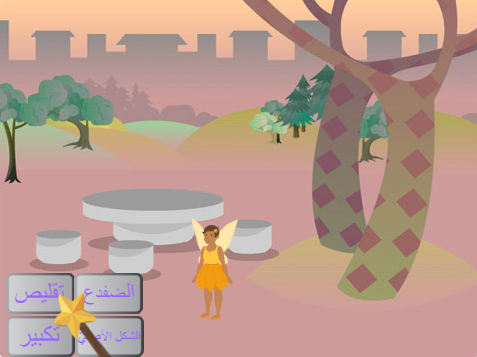
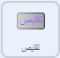
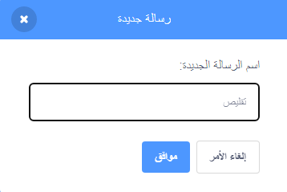
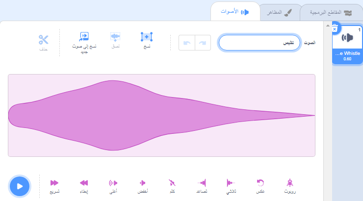

## تعويذة التقليص

<div style="display: flex; flex-wrap: wrap">
<div style="flex-basis: 200px; flex-grow: 1; margin-right: 15px;">
الآن ستجعل الجنّيّة تتقلّص عندما تنقر على زرّ التقليص.
</div>
<div>
{:width="300px"}
</div>
</div>

--- task ---

انقر على الكائن **shrink** في قائمة الكائن أسفل المنصّة.

أضِف المقطع البرمجي `عند نقر هذا الكائن`{:class="block3events"}:



```blocks3
when this sprite clicked
```

--- /task ---

عندما تضغط على زرّ التقليص، فأنت تريد أن يتقلّص كائن **Fairy** (الجنّيّة).

كائن **قلّص** يحتاج إلى `بثّ`{:class="block3events"} `رسالة`{:class="block3events"} حتّى يعرف كائن **Fairy** (الجنّيّة) أنّ تعويذة التقليص قد أُلقِيَت.

--- task ---

أضف كتلة `بثّ`{:class="block3events"}:


```blocks3
when this sprite clicked
+ broadcast (message1 v)
```

--- /task ---

--- task ---

انقر على `الرسالة1`{:class="block3events"} واختر 'رسالة جديدة'. أعطِ اسم الرسالة الجديدة `تقليص`.



يجب أن تبدو التعليمات البرمجية خاصتك بالشكل التالي:


```blocks3
when this sprite clicked
broadcast (تقليص v)
```

--- /task ---

والآن عندما تضغط على زرّ **تقليص قلّص**، سيقوم برنامج Scratch بعمليّة `بثّ`{:class="block3events"} رسالة كائن `تقليص`{:class="block3events"}، لكن لن يحدث شيء حتّى الآن.

--- task ---

أضف المقطع البرمجيّ إلى كائن **Fairy** (الجنّيّة)، لتتقلّص عندما تتلقّى رسالة `تقليص`{:class="block3events"}:


```blocks3
when I receive [تقليص v]
change size by [-10] // الأرقام السالبة تقلل الحجم
```

--- /task ---

--- task ---

**اختبار:** انقر على زرّ **قلّص** ليتقلّص كائن **Fairy** (الجنّيّة). نفّذ الأمر عدّة مرّات كما تريد.

**تصحيح:** إذا كان كائن **Fairy** (الجنّيّة) الخاصّ بك يزداد حجمًا بدلًا من تقلّصه، أضف علامة ناقص `-` قبل الرقم `10`، للحصول على قيمة سالبة (`10-`).

--- /task ---

--- task ---

أضف المقطع البرمجيّ `عند نقر العلم الأخضر`{:class="block3events"}، لجعل **Fairy** (الجنّيّة) تعود إلى حجمها الطبيعيّ:


```blocks3
when flag clicked
set size to [100] %
```

--- /task ---

عندما تتمّ عمليّة `بثّ`{:class="block3events"} الرسائل، ستستقبلها كلّ الكائنات. عندما `يتلقّى`{:class="block3events"} كائن **Wand** (العصا) رسالة `تقليص`{:class="block3events"}، يجب أن `تشغّل صوتًا`{:class="block3sound"}.

--- task ---

انقر على كائن **Wand** (العصا)، ثمّ اذهب إلى قسم **الأصوات**.

قم بإضافة صوت **Slide Whistle**.

غير اسم الصوت إلى `تقليص`، ليسهل عليك إيجاده.




--- /task ---

--- task ---

أضف مقطعًا برمجيًّا لتشغيل الصوت:


```blocks3
when I receive [تقليص v]
play sound [تقليص v] until done

```

--- /task ---

--- task ---

**اختبار:** انقر على العلم الأخضر لتشغيل مشروعك. انقر على زرّ **تقليص** للاستماع إلى الصوت ورؤية **Fairy** (الجنّيّة) تتقلّص.

--- /task ---

زرّ **تقليص** يقوم بعمليّة `بثّ`{:class="block3events"} رسالة `تقليص`{:class="block3events"}. كلّ من كائن **Fairy** (الجنّيّة) وكائن **Wand** (العصا) سيقومان بعمليّة `تلقّي`{:class="block3events"} الرسالة وسيستجيبان لها.

--- save ---
