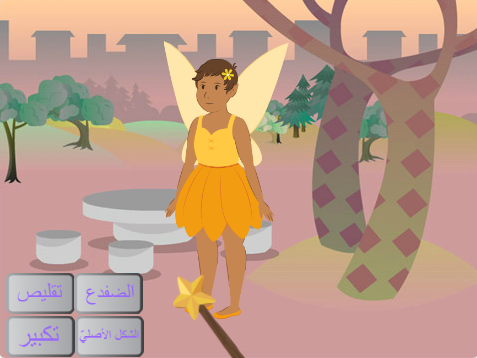
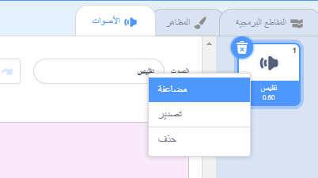
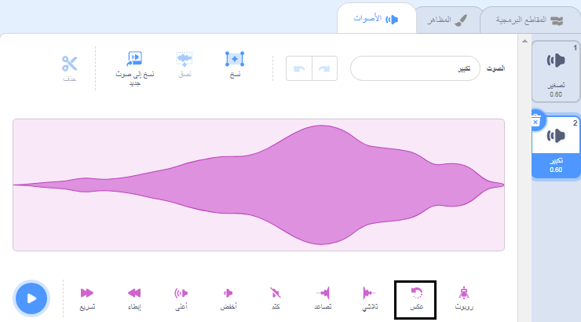

## تعويذة التكبير

<div style="display: flex; flex-wrap: wrap">
<div style="flex-basis: 200px; flex-grow: 1; margin-right: 15px;">
أنت أيضًا بحاجة إلى تعويذة تكبير، لتعيد كائن **Fairy** (الجنّيّة) إلى حجمه الطبيعيّ، أو لتجلعها أضخم بكثير!
</div>
<div>
{:width="300px"}
</div>
</div>

**تلميح:** في هذه الخطوة ستضيف مقاطع برمجيّة لثلاثة كائنات. تأكّد من أنّك تختار الكائن الصحيح من قائمة الكائن أسفل المنصّة، واضغط على قسم المقاطع البرمجيّة.

--- task ---

أضف مقطعًا برمجيًّا إلى زرّ كائن **تكبير**، لتتمّ عمليّة `بثّ`{:class="block3events"} رسالة `تكبير`{:class="block3events"}:


```blocks3
when this sprite clicked
broadcast (تكبير v)
```

--- /task ---

--- task ---

أضف مقطعًا برمجيًّا لتجعل كائن **Fairy** (الجنّيّة) يكبر:


```blocks3
when I receive [تكبير v]
change size by [10] // الأرقام الموجبة تزيد من الحجم
```

--- /task ---

يمكنك عكس صوت 'التقليص' لإصدار صوت 'التكبير'!

<p style="border-left: solid; border-width:10px; border-color: #0faeb0; background-color: aliceblue; padding: 10px;">
<span style="color: #0faeb0">**اختبارات الأغاني المشَغَّلة عكسيًّا**</span> هي اختبارات موسيقيّة مطوَّرة. تُعكَس الأغنية، وعلى المتسابقين تخمين الأغنية الأصليّة - الأمر ليس سهلًا كما يبدو. 
</p>

--- task ---

اختر كائن **Wand** (العصا)، ثمّ انقر على قسم **الأصوات**.

انقر على الزرّ الأيمن (أو على الزرّ الأيسر ضغطة مطوّلة) على صوت **تقليص**، ثمّ اختر **مضاعفة**.




أعطِ النسخة الجديدة اسم `تكبير`.

انقر على أيقونة **عكس** لتشغيل الصوت بشكل عكسي.



--- /task ---

--- task ---

أضف مقطعًا برمجيًّا إلى كائن **Wand** (العصا)، ليؤدّي صوت `تكبير`{:class="block3sound"} عندما يتلقّى رسالة `تكبير`{:class="block3events"}:


```blocks3
when I receive [تكبير v]
play sound [تكبير v] until done
```

--- /task ---

--- task ---

**اختبار:** انقر على الأزرار السحريّة **تقليص** و**تكبير** لتلقي التعويذات السحريّة بالعدد الّذي تريد.

--- /task ---

--- save ---

