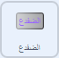
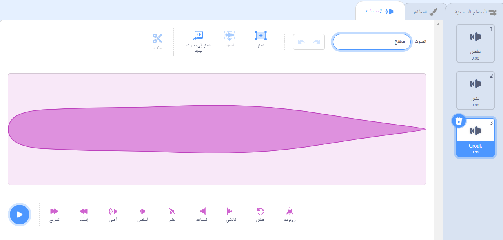
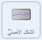

## تحوّل الضفدع

<div style="display: flex; flex-wrap: wrap">
<div style="flex-basis: 200px; flex-grow: 1; margin-right: 15px;">
حان الوقت الآن لتعويذة أخرى. هذه المرة ستقوم بإلقاء تعويذة تحول عن طريق بث رسالة `ضفدع`{:class="block3events"} التي تحول كائن **Fairy** (الجنّيّة) إلى ضفدع! 

ربما ستنطلق في مغامرة يكون فيها شكل الضفدع أكثر فائدة.
</div>
<div>
{:width="300px"}
</div>
</div>

--- task ---

أضف نصًا إلى كائن الزر **الضفدع** لبث رسالة "ضفدع":



```blocks3 
when this sprite clicked
broadcast [toad v]
```

--- /task ---

--- task ---

حدد كائن **Fairy** (الجنّيّة) وانقر فوق علامة التبويب **المظاهر**.

لتحويل الكائن **Fairy** (الجنّيّة) إلى ضفدع ، ستستخدم الاشكال **Fairy-a** و **Fairy-toad-a**.


--- /task ---

--- task ---

انقر فوق علامة التبويب **المقاطع البرمجية** وأضف المقطع البرمجيّ `غيّر المظهر إلى`{:class="block3looks"}، في نهاية مجموعة المقاطع البرمجية `عند نقر العلم`{:class="block3events"} الموجودة لديك، بحيث تكون الجنّيّة في شكلها الإنسانيّ عند بداية تشغيل مشروعك:


```blocks3
when flag clicked
set size to [100] %
+ switch costume to [Fairy-a v]
```

--- /task ---

--- task ---

أضف مقطعًا برمجيًّا جديدًا إلى كائن **Fairy** (الجنّيّة)، ليتحول إلى ضفدع:


```blocks3  
when I receive [toad v]
switch costume to [Fairy-toad-a v]
```

--- /task ---

--- task ---

أضف صوت **Croak** إلى كائن **Wand** (العصا).

غيّر الصوت إلى `ضفدع`:




--- /task ---

--- task ---

أضف مقطعًا برمجيًّا إلى كائن **Wand** (العصا)، ليؤدّي صوت `ضفدع`{:class="block3sound"} عند إلقاء تعويذة الضفدع:


```blocks3  
when I receive [toad v]
play sound [toad v] until done
```

--- /task ---

--- task ---

**اختبار:** اختبر إن كان بإمكانك تحويل **الجنية** إلى ضفدع، مع التأثير الصوتي، عندما تنقر على زر **الضفدع**. انقر على العلم الأخضر مجدّدًا، لتحويل كائن **الجنية** إلى بشري مرة أخرى.


--- /task ---

التعويذة المعاكسة لتعويذة 'الضفدع' هي تعويذة 'الشكل الأصلي'.

--- task ---

أضف مقطعًا برمجيًّا إلى كائن زر **الشكل الأصلي**، لتتم عملية `بث`{:class="block3events"} لرسالة 'الشكل الأصلي'{:class="block3events"}:



```blocks3 
when this sprite clicked
broadcast [untoad v]
```

--- /task ---

--- task ---

أضف مقطعًا برمجيًّا جديدًا على كائن **Fairy** (الجنية)، من أجل الرجوع إلى `الشكل الأصلي`{:class="block3events"}:


```blocks3  
when I receive [untoad v]
switch costume to [Fairy-a v]
```

--- /task ---

--- task ---

انقر على كائن **Wand** (العصا)، ثمّ انتقل إلى قسم **الأصوات**.

نفذ عملية **مضاعفة** لصوت **الضفدع**، ثم أعطه اسم `الشكل الأصلي`.

انقر على أيقونة **عكس**، لتعكس صوت **الشكل الأصلي**.


--- /task ---

--- task ---

أضف مقطعًا برمجيًّا إلى كائن **Wand** (العصا) ليؤدّي صوت `الشكل الأصليّ`{:class="block3sound"}:


```blocks3  
when I receive [untoad v]
play sound [untoad v] until done
```

--- /task ---

--- task ---

**اختبار:** جرب تعويذتي **الضفدع** و**الشكل الأصلي**، ثم جرب **تقليص** و**تكبير** كائن **Fairy** (الجنية) عندما يكون محوّلًا إلى شكل الضفدع.

--- /task ---

--- save ---
