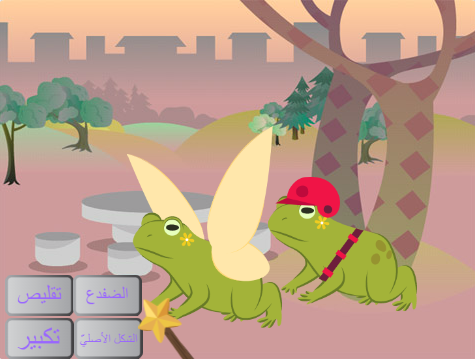
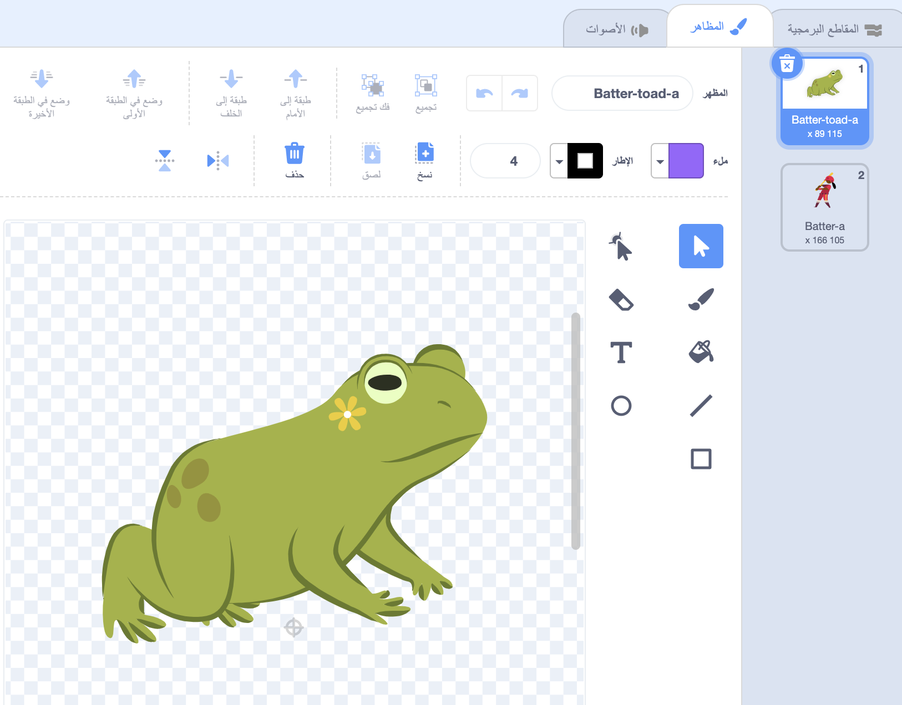
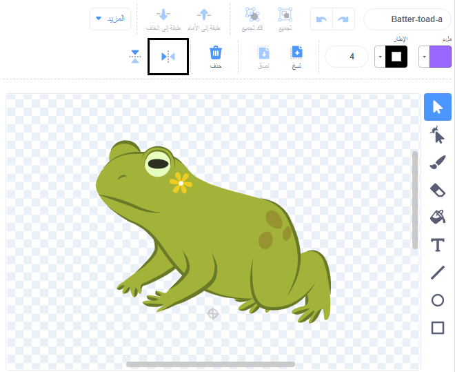

## أضف شخصية أخرى

احصل على كائن من اختيارك للرد على التعويذات. سوف تحتاج إلى إنشاء زي الضفدع "مزج" للكائن ، وإضافة رمز حتى يتغير الزي عند بث الرسائل الإملائية.

! [تُظهر المرحلة تحول الضفدع الثاني.](images/another-character.png){:width="300px"}

--- task ---

ضاعف كائن **Fairy**.

احذف الزي **Fairy-a** و **Fairy-toad-a**. ستترك مع زي **الضفدع**.

أضف زيًا من اختيارك إلى **كائن جديد**.

اخترنا **الخليط**:

قد ترغب في تغيير الاتجاه الذي يشير إليه الكائن.

**نصيحة:** إذا انقلب الكائن الخاص بك رأسًا على عقب، فيمكنك تغيير `نمط الدوران`{:class="block3motion"} إلى `يمين-يسار`{:class="block3motion"} في جزء خصائص الكائن أو باستخدام الكتلة البرمجية.

--- /task ---

عندما تنمو أو تتقلص كائنًا ما ، فأنت تريد أن تبقى القدمان في نفس المكان.

--- task ---

استخدم أولاً أداة **الاختيار** (السهم) لرسم مستطيل حول الزي ثم **تجميع**. ثم اسحب شخصيتك فوق علامة التقاطع.

--- /task ---

--- task ---

انقر على مظهر **toad**.

أعد تسمية الزي ليتناسب مع شبحك ، استخدمنا **Batter-toad-a**.

--- /task ---

--- task ---

إذا كان زي الضفدع يواجه الاتجاه المعاكس للزي الرئيسي ، يمكنك استخدام **عكس افقيا**.

--- /task ---

الآن أنت بحاجة إلى جعل الضفدع يبدو مثل الشخصية. الجمع بين اثنين من الأزياء بهذه الطريقة يسمى "المزج".

--- task ---

يمكنك إضافة تفاصيل صغيرة ، مثل بقعة من الألوان ، أو نسخ ولصق النظارات الشمسية أو قبعة في محرر الرسام.

**نصيحة:** يمكنك إضافة أي زي لشخصيتك. استخدم أداة **تحديد** (السهم) ثم انقر على **نسخ** أو **لصق**.

**نصيحة:** يمكنك تجميع كل الكائنات في زي ما. حددهم (باستخدام أداة **تحديد** أو <kbd> بالضغط على الازرار Ctrl-a</kbd> من لوحة المفاتيح) ثم انقر فوق **تجميع**.

الضفدع Batter الخاص بنا يشبه: 

--- /task ---

--- task ---

قم بالتبديل إلى علامة التبويب **المظاهر** للكائن الخاص بك.

استبدل جميع الكتل البرمجية الخاصة بـ `غيّر المظهر`{:class="block3looks"} لتستخدم الزي الصحيح للكائن الجديد الخاص بك.

قد ترغب أيضًا في تغيير حجم البداية ``{: class = "block3looks"} للعنصر `عند النقر على العلم الأخضر`{: class = "block3events"}.

--- /task ---

--- task ---

**اختبار:** انقر فوق أزرار التعاويذ - يجب أن يستجيب كلاهما لرسائل بث التعاويذ.

**تصحيح:** تأكد من أنك قمت بتغيير الأزياء في كتل `غيّر المظهر`{:class="block3looks"} للكائن الجديد الخاص بك.

--- /task ---

--- save ---
