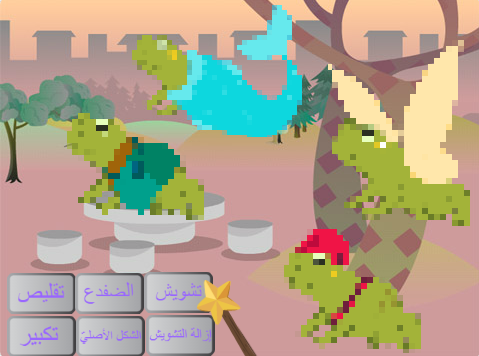
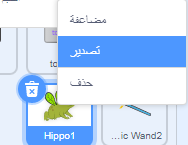
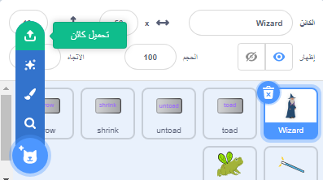

## قم بترقية او تطوير مشروعك

كيف ستوسع عالمك السحري؟ يمكنك:
+ إضافة المزيد من الشخصيات
+ إضافة تأثيرات صوتية ومرئية مختلفة إلى العصا السحرية.
+ أضف المزيد من التعاويذ - يمكنك جعل الشخصيات تختفي وتعاود الظهور باستخدام كتلة `اخف`{:class="block3looks"} و كتلة `اظهر`{:class="block3looks"}، طبّق تأثيرات بصرية لقلبهم رأسًا على عقب.

لماذا لا تتبادل الشخصيات مع صديق؟ أولاً، استبدل رابط المشروع مع صديق لرؤية الكائنات التي صنعها كلٌّ منكما. لحفظ الكائنات الخاصة بهم، استخدم حقيبة ظهر Scratch الخاصة بك أو حمّل الكائنات في منطقة مشتركة. ثم ارجع إلى مشروعك وأضف الكائنات المحفوظة.

[[[scratch-backpack]]]

--- collapse ---
---
title: قم بتحميل كائن
---

يمكنك حفظ الكائنات على جهاز الحاسوب الخاص بك عن طريق تنزيلها من مشروعك. انقر بزر الماوس الأيمن فوق كائن في قائمة الكائنات واختر تصدير.

لتحميل كائن في مشروع، اختر خيار "تحميل كائن" من قائمة "اختيار كائن".

--- /collapse ---

ابتكر المزيد من التعاويذ مع صديق وأضفها إلى شخصياتك. حدد التعاويذ التي تريد إنشاءها. تحقق أن كلَيكما يستخدم نفس الاسم تمامًا لرسائل البث.

--- collapse ---
---
title: مشروع مكتمل
---

يمكنك عرض [المشروع المكتمل هنا](https://scratch.mit.edu/projects/659611627/){:target="_blank"}.

--- /collapse ---

--- save ---
