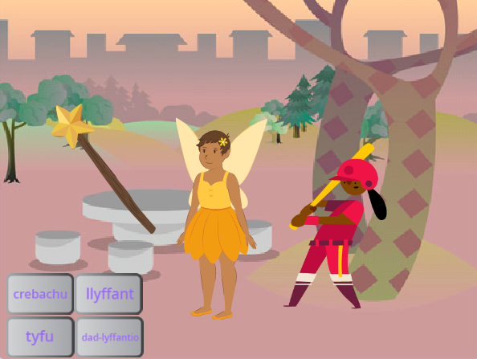

## Byddi di'n creu

Creu ap lle rwyt ti'n defnyddio ffon hud i droi corluniaid yn llyffantod, ac yn eu tyfu a'u crebachu.

Byddi di'n:
+ Creu botymau sy'n `darlledu`{:class="block3events"} negeseuon i gorluniaid eraill
+ Gwneud i fwy nag un corlun ymateb pan fyddan nhw'n `derbyn`{:class="block3events"} yr un neges
+ Defnyddio'r ddewislen blociau `Sain`{:class="block3sound"} i wrthdroi seiniau

Mae **Darlledu** a **derbyn** negeseuon fel patrwm **galw ac ateb** mewn cerddoriaeth.
 
 
  "Mae P3T3 P3T3 yn gân draddodiadol yn Ghana, Gorllewin Affrica. Mae'n cael ei pherfformio gan un person sy'n arwain ac sy'n **galw** a grŵp sy'n **ymateb** drwy ailadrodd ymadrodd allweddol pan fyddan nhw'n clywed yr alwad." - Kwame Bakoji-Hume, CIC African Activities 

<audio controls><source src="images/Pete-Pete.mp3" type="audio/wav"></audio>  

--- no-print ---

### Chwarae ▶️

--- task ---

  
Defnyddia'r ffon hud i glicio ar y botymau a defnyddio swynion. Beth mae pob swyn yn ei wneud i'r cymeriadau?

  <iframe allowtransparency="true" width="485" height="402" src="https://scratch.mit.edu/projects/embed/518413238/?autostart=false" frameborder="0"></iframe>

--- /task ---
--- /no-print ---

--- print-only ---

--- /print-only ---

