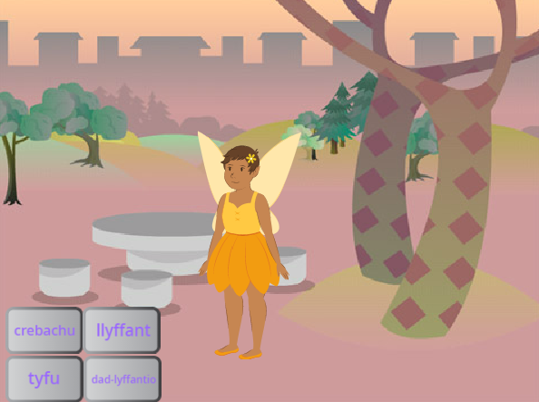

## Dewisa dy ffon hud

<div style="display: flex; flex-wrap: wrap">
<div style="flex-basis: 200px; flex-grow: 1; margin-right: 15px;">
Yn y cam yma, byddi di'n gosod yr olygfa, yn dewis dy ffon hun ac yn creu dy hud a lledrith cyfrifiadurol dy hun.
  
</div>
<div>
{:width="300px"}
</div>
</div>

<p style="border-left: solid; border-width:10px; border-color: #0faeb0; background-color: aliceblue; padding: 10px;">
Mae modd defnyddio <span style="color: #0faeb0">**delweddau wedi'u cynhyrchu â chyfrifiadur (CGI)**</span> i greu effeithiau arbennig sydd ddim yn digwydd yn y byd go iawn. Mae creu ffilm ffantasi neu animeiddiad modern yn golygu llawer o god a chelf gyfrifiadurol.
</p>

--- task ---

Agora'r [prosiect cychwynnol darlledu swynion](https://scratch.mit.edu/projects/518441891/editor){:target="_blank"}. Bydd Scratch yn agor mewn tab arall ar y porwr.

[[[working-offline]]]

--- /task ---

--- task ---

Dylet ti weld tylwythen deg mewn coedwig.



--- /task ---

Mae angen ffon hud arnat ti i fwrw swyn.

--- task ---

Clicia ar **Dewiswch Gorlun** a theipio `wand` yn y blwch chwilio:


**Dewis:** Ychwanega'r ffon hud sydd orau gen ti i dy brosiect.

--- /task ---

--- task ---

Ychwanega god i wneud i'r corlun **Wand** ddilyn y `pwyntydd llygoden`{:class="block3motion"} ac aros `o flaen`{:class="block3looks"} y botymau:


```blocks3
when flag clicked
forever
go to (mouse-pointer v) //change from 'random position'     
go to [front v] layer // in front of the buttons
end
```

--- /task ---

--- task ---

**Prawf:** Clicia ar y faner werdd i redeg dy brosiect. Bydd y ffon hud yn dilyn pwyntydd dy lygoden.

--- /task ---

Gwna'r ffon hud yn fwy a'i rhoi ar ogwydd, fel pe baet ti'n ei defnyddio go iawn.

--- task ---

Cer i'r cwarel Sprite a newid y briodwedd **Maint** i `200` er mwyn gwneud y ffon hud yn fwy:


--- /task ---

--- task ---

Clicia ar y tab **Gwisgoedd** i agor y wisg Wand yn y Golygydd paent.

Clicia'r offeryn **Dewis** (Saeth) ac yna tynna betryal o gwmpas y ffon hud gyfan er mwyn dewis pob rhan o'r wisg.


Wedyn clicia ar yr eicon **Grŵp** i gyfuno rhannau'r ffon hud.


--- /task ---

--- task ---

Defnyddia'r offeryn **Cylchdroi** ar y ffon hud i'w gosod ar ongl.


**Awgrym:** Os nad wyt ti'n gweld yr offeryn **Cylchdroi**, clicia'r offeryn **Pellhau** (-) ar waelod y golygydd Paent i bellhau.

--- /task ---

Mae'r wisg **Wand** yn mynd yn ffordd pwyntydd y llygoden pan fyddi di'n ceisio clicio ar y botymau.

--- task ---

Symuda'r ffon hud fel bod ei blaen ychydig i ffwrdd o'r targed yn y canol.


--- /task ---

--- task ---

**Prawf:** Clicia'r faner werdd a symud y llygoden o amgylch y Llwyfan. Dylai'r ffon hud ddilyn.

--- /task ---

--- task ---

Os wyt ti wedi mewngofnodi i dy gyfrif Scratch, clicia'r botwm Remix gwyrdd. Bydd hyn yn cadw copi o'r prosiect i dy gyfrif Scratch.


Galli di newid teitl dy brosiect.


**Awgrym:** Rho enwau defnyddiol i dy brosiectau fel bod modd dod o hyd iddyn nhw'n hawdd pan fydd gen ti lawer o brosiectau.

Os nad oes gen ti gyfrif Scratch, galli di glicio ar **Ffeil** ac yna **Cadw i'ch cyfrifiadur** i gadw copi o'r prosiect.

--- /task ---

--- save ---
