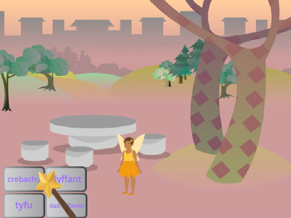
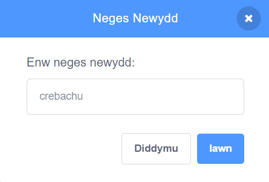

## Y swyn crebachu

<div style="display: flex; flex-wrap: wrap">
<div style="flex-basis: 200px; flex-grow: 1; margin-right: 15px;">
Nawr rwyt ti'n mynd i wneud i'r Dylwythen Deg grebachu pan fyddi di'n clicio'r botwm crebachu.
</div>
<div>
{:width="300px"}
</div>
</div>

--- task ---

Clicia'r corlun **crebachu** yn y rhestr Corluniau sydd dan y Llwyfan.

Ychwanega floc `pan gaiff y ciplun yma ei glicio`{:class="block3events"}:


```blocks3
when this sprite clicked
```

--- /task ---

Mae angen i'r corlun **Fairy** grebachu pan fyddi di'n clicio'r botwm crebachu.

Mae angen i'r corlun **crebachu** `ddarlledu`{:class="block3events"} `neges`{:class="block3events"} fel bod y corlun **Fairy** yn gwybod bod swyn crebachu wedi cael ei ddefnyddio.

--- task ---

Ychwanega floc `darlledu`{:class="block3events"}:


```blocks3
when this sprite clicked
+ broadcast (message1 v)
```

--- /task ---

--- task ---

Clicia `neges1`{:class="block3events"} a dewis 'Neges newydd'. Rho'r enw `crebachu` i'r neges newydd.



Dylai dy god edrych fel hyn:


```blocks3
when this sprite clicked
broadcast (crebachu v)
```

--- /task ---

Nawr pan fyddi di'n clicio'r botwm **crebachu**, bydd Scratch yn `darlledu`{:class="block3events"} y neges `crebachu`{:class="block3events"}, ond fydd dim byd yn digwydd eto.

--- task ---

Ychwanega god at y corlun **Fairy** i wneud iddo grebachu pan fydd yn cael neges `crebachu`{:class="block3events"}:


```blocks3
when I receive [crebachu v]
change size by [-10] // mae rhifau negyddol yn lleihau'r maint
```

--- /task ---

--- task ---

**Prawf:** Clicia'r botwm **crebachu** i grebachu'r corlun **Fairy**. Gwna hyn gymaint o weithiau ag wyt ti eisiau.

**Dad-fygio:** Os ydy dy gorlun **Fairy** yn tyfu yn lle crebachu, ychwanega arwydd minws `-` cyn y rhif `10` i'w droi yn rhif negyddol `-10`.

--- /task ---

--- task ---

Ychwanega sgript i osod y corlun **Fairy** i faint arferol `pan fydd y faner werdd`{:class="block3events"} wedi'i chlicio:


```blocks3
when flag clicked
set size to [100] %
```

--- /task ---

Pan fydd negeseuon yn cael eu `darlledu`{:class="block3events"} gall pob corlun eu derbyn. Pan fydd y corlun **Wand** yn `derbyn`{:class="block3events"} y neges `crebachu`{:class="block3events"} dylai `chwarae sain`{:class="block3sound"}.

--- task ---

Clicia'r corlun **Wand** ac wedyn y tab **Seiniau**.

Ychwanega'r sain **Slide Whistle**.

Ail-enwa'r sain i `crebachu` fel ei bod yn hawdd dod o hyd iddi.


--- /task ---

--- task ---

Ychwanega sgript i chwarae'r sain:


```blocks3
when I receive [crebachu v]
play sound [crebachu v] until done

```

--- /task ---

--- task ---

**Prawf:** Clicia ar y faner werdd i redeg dy brosiect. Clicia'r botwm **crebachu** i glywed y sain ac i weld y corlun **Fairy** yn crebachu.

--- /task ---

Mae'r botwm **crebachu** yn `darlledu`{:class="block3events"} neges `crebachu`{:class="block3events"}. Fe wnaeth y corluniau **Fairy** a **Wand** `dderbyn`{:class="block3events"} y neges ac ymateb iddi.

--- save ---
