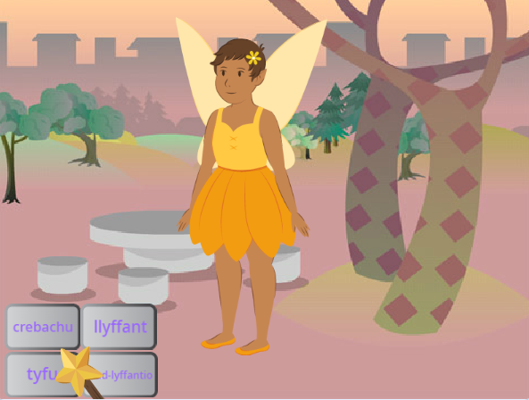
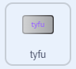
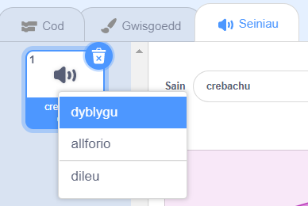
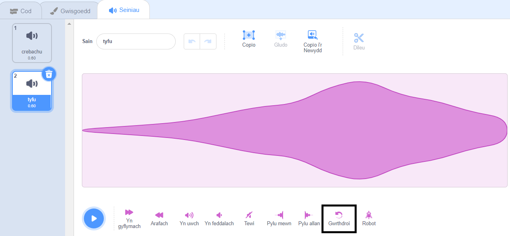

## Y swyn tyfu

<div style="display: flex; flex-wrap: wrap">
<div style="flex-basis: 200px; flex-grow: 1; margin-right: 15px;">
Mae angen swyn tyfu arnat ti hefyd i ddychwelyd y corlun **Fairy** i faint arferol neu i wneud tylwyth teg enfawr!
</div>
<div>
{:width="300px"}
</div>
</div>

**Awgrym:** Yn y cam hwn, byddi di'n ychwanegu cod at dri chorlun gwahanol. Gwna'n siŵr dy fod ti'n dewis y corlun cywir o'r rhestr Corluniau o dan y Llwyfan a chlicio ar y tab **Cod**.

--- task ---

Ychwanega sgript at gorlun y botwm **tyfu** er mwyn `darlledu`{:class="block3events"} neges `tyfu`{:class="block3events"}:



```blocks3
when this sprite clicked
broadcast (grow v)
```

--- /task ---

--- task ---

Ychwanega sgript i wneud i'r corlun **Fairy** dyfu:


```blocks3
when I receive [grow v]
change size by [10] // positive numbers increase the size
```

--- /task ---

Galli di wrthdroi'r sain 'crebachu' i greu sain 'tyfu'!

<p style="border-left: solid; border-width:10px; border-color: #0faeb0; background-color: aliceblue; padding: 10px;">
Mae <span style="color: #0faeb0">**Cwisiau caneuon wedi'u chwarae am yn ôl**</span> yn gwisiau cerddoriaeth gyda gwahaniaeth pwysig. Mae'r traciau'n cael eu gwrthdroi, ac mae'n rhaid i gystadleuwyr ddyfalu'r gân wreiddiol - ddim mor hawdd ag y mae'n swnio. 
</p>

--- task ---

Dewisa'r corlun **Wand** a chlicia'r tab **Seiniau**.

De-glicia (neu daro a dal) y sain **crebachu** a dewis **dyblygu**.




Enwa'r copi newydd yn `tyfu`.

Clicia ar **Gwrthdroi** i wneud i'r sain chwarae am yn ôl.



--- /task ---

--- task ---

Ychwanega sgript at y corlun **Wand** i chwarae'r sain `tyfu`{:class="block3sound"} pan gaiff y neges `tyfu`{:class="block3events"} ei derbyn:


```blocks3
when I receive [grow v]
play sound [grow v] until done
```

--- /task ---

--- task ---

**Prawf:** Clicia ar y botymau swyn **crebachu** a **tyfu** i fwrw'r swynion gymaint o weithiau ag wyt ti'n dymuno.

--- /task ---

--- save ---

