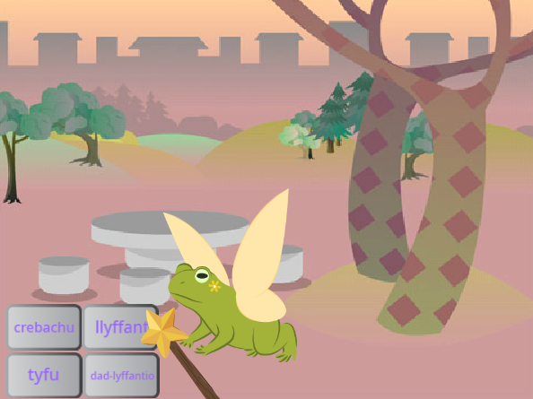
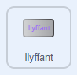
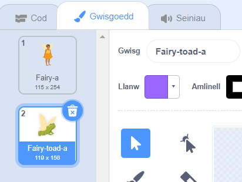
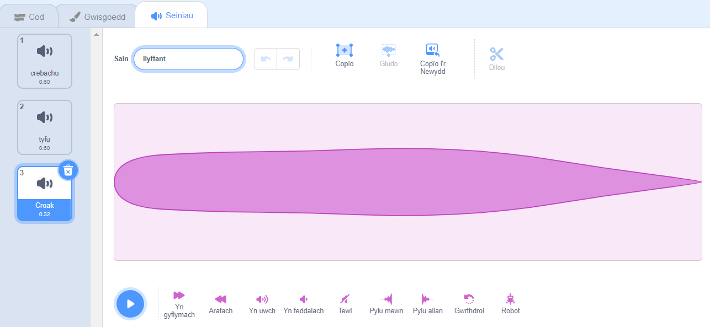
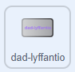
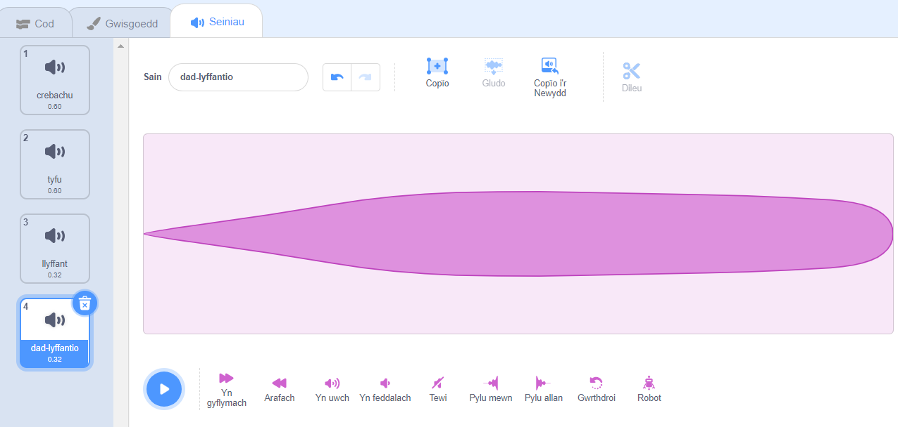

## Trawsnewid llyfant

<div style="display: flex; flex-wrap: wrap">
<div style="flex-basis: 200px; flex-grow: 1; margin-right: 15px;">
Nawr mae'n amser bwrw swyn arall. Y tro hwn rwyt ti'n mynd i fwrw swyn trawsnewid drwy ddarlledu neges `llyffant`{:class="block3events"} sy'n troi'r corlun **Fairy** yn llyffant! 

Falle ei bod hi'n mynd ar antur lle bydd bod yn llyffant yn fwy defnyddiol.
</div>
<div>
{:width="300px"}
</div>
</div>

--- task ---

Ychwanega sgript at gorlun y botwm **llyffant** i ddarlledu'r neges 'llyffant':



```blocks3 
when this sprite clicked
broadcast [llyffant v]
```

--- /task ---

--- task ---

Dewisa'r corlun **Fairy** a chlicio'r tab **Gwisgoedd**.

I drawsffurfio'r corlun **Fairy** yn llyffant byddi di'n defnyddio'r gwisgoedd **Fairy-a** a **Fairy-toad-a**.



--- /task ---

--- task ---

Clicia'r tab **Code** ac ychwanegu bloc `newid gwisg i`{:class="block3looks"} at ddiwedd dy sgript `pan fydd y faner werdd wedi'i chlicio`{:class="block3events"} fel fod y Fairy yn ei ffurf dynol pan fyddi di'n rhedeg dy brosiect:


```blocks3
when flag clicked
set size to [100] %
+ switch costume to [Fairy-a v]
```

--- /task ---

--- task ---

Ychwanega sgript newydd i'r corlun **Fairy** i'w droi yn llyffant:


```blocks3  
when I receive [llyffant v]
switch costume to [Fairy-toad-a v]
```

--- /task ---

--- task ---

Ychwanega'r sain **Croak** at y corlun **Wand**.

Ail-enwa'r sain i `llyffant`:




--- /task ---

--- task ---

Ychwanega sgript at y corlun **Wand** sy'n chwarae'r sain `llyffant`{:class="block3sound"} pan gaiff y swyn llyffant ei bwrw:


```blocks3  
when I receive [llyffant v]
play sound [llyffant v] until done
```

--- /task ---

--- task ---

**Prawf:** Gwna'n siŵr dy fod yn gallu troi'r corlun **Fairy** yn llyffant, gydag effaith sain, pan fyddi di'n clicio'r botwm **llyffant**. Clicia ar y faner werdd eto i droi corlun **Fairy** yn ôl yn berson.


--- /task ---

Y gwrthwyneb i'r swyn 'llyffant' yw'r swyn 'dad-lyffantio'.

--- task ---

Ychwanega sgript i gorlun y botwm **dad-lyffantio** i `ddarlledu`{:class="block3events"} y neges 'dad-lyffantio'{:class="block3events"}:



```blocks3 
when this sprite clicked
broadcast [dad-lyffantio v]
```

--- /task ---

--- task ---

Ychwanega sgript newydd i `dad-lyffantio`{:class="block3events"} y corlun **Fairy**:


```blocks3  
when I receive [dad-lyffantio v]
switch costume to [Fairy-a v]
```

--- /task ---

--- task ---

Dewisa'r corlun **Wand** a newid i'r tab **Seiniau**.

**Dyblyga'r** sain **llyffant** a newid ei henw i `dad-lyffantio`.

Clicia'r eicon **Gwrthdroi** fel bod y sain **dad-lyffantio** yn chwarae am yn ôl.




--- /task ---

--- task ---

Ychwanega sgript at y corlun **Wand** i chwarae'r sain `dad-lyffantio`{:class="block3sound"}:


```blocks3  
when I receive [dad-lyffantio v]
play sound [dad-lyffantio v] until done
```

--- /task ---

--- task ---

**Prawf:** Rho gynnig ar fwrw'r swynau **llyffant** ac **dad-lyffantio**, a rho gynnig ar **crebachu** a **thyfu** pan fydd y **Fairy** ar ffurf llyffant.

--- /task ---

--- save ---
