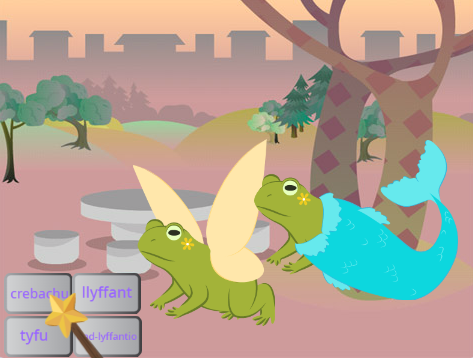
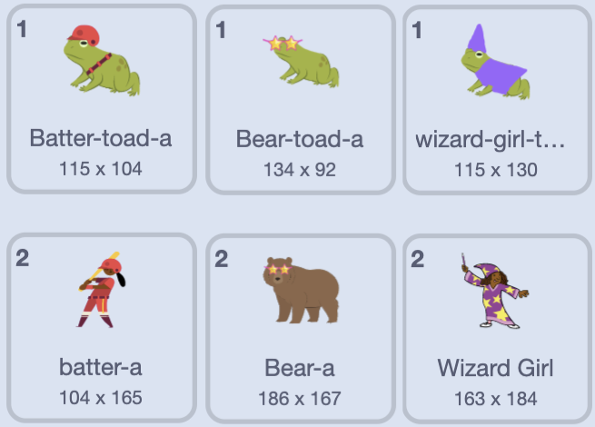
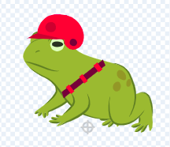

## Ychwanegu cymeriad arall

Cael corlun o dy ddewis i ymateb i'r swynion. Bydd angen i ti greu gwisg llyffant 'stwnsh' ar gyfer y corlun, ac ychwanegu cod fel bod y wisg yn newid pan fydd negeseuon y swynion yn cael eu darlledu.

{:width="300px"}

--- task ---

Dyblyga'r corlun **Fairy**.

Dilea'r gwisgoedd **Fairy-a** a **Fairy-toad-a**. Bydd gen ti wisg **llyffant** ar ôl.

Ychwanega wisg o dy ddewis at y **corlun newydd**.

Fe ddewison ni **Batter**:

Efallai yr hoffet ti newid y cyfeiriad mae'r corlun yn pwyntio iddo.

**Awgrym:** Os ydy dy gorlun yn mynd wyneb i waered galli di newid ei `steil cylchdroi`{:class="block3motion"} i `chwith-dde`{:class="block3motion"} yn y cwarel Sprite properties neu drwy ddefnydio bloc o god.

--- /task ---

Pan fyddi di'n tyfu neu'n crebachu corlun, mae angen i'r traed aros yn yr un lle.

--- task ---

Yn gyntaf, defnyddia'r offeryn **Dewis** (saeth) i dynnu petryal o amgylch y wisg ac yna ei **Grwpio**. Wedyn llusga dy gymeriad uwchben y targed.

--- /task ---

--- task ---

Clicia'r wisg **llyffant**.

Ail-enwa'r wisg i gyd-fynd â dy gorlun, fe wnaethon ni ddefnyddio **Batter-toad-a**.

--- /task ---

--- task ---

Os ydy gwisg y llyffant yn wynebu i ffwrdd i'r brif wisg galli di ddefnyddio **Troi'n Llorweddol**.

--- /task ---

Nawr mae angen i ti wneud i'r llyffant edrych fel y cymeriad. Gelwir cyfuno dwy wisg fel hyn yn 'stwnsh'.

--- task ---

Fe allet ti ychwanegu manylyn bach, fel sblash o liw, neu gopïo a gludo sbectol haul neu het yn y golygydd Paint.

**Awgrym:** Galli di ychwanegu unrhyw wisg at gorlun dy gymeriad. Defnyddia'r offeryn **Dewis** (saeth) neu glicio ar **Copïo** neu **Gludo**.

**Awgrym:** Mae'n bosib grwpio pob gwrthrych sydd mewn gwisg. Dewisa nhw (gyda'r offeryn **Dewis** neu <kbd>Ctrl-a</kbd>) ac yna clicia ar **Grŵp**.

Mae ein llyffant Batter yn edrych fel hyn: 

--- /task ---

--- task ---

Newidia i'r tab **Cod** ar gyfer dy gorlun newydd.

Newidia pob un o'r blociau `newid gwisg`{:class="block3looks"} i ddefnyddio'r gwisgoedd cywir ar gyfer dy gorlun newydd.

Efallai byddi di hefyd am newid `maint`{:class="block3looks"} cychwynnol y corlun `pan fydd y fflag werdd wedi'i chlicio`{:class="block3events"}.

--- /task ---

--- task ---

**Prawf:** Clicia ar fotymau'r swynion — dylai'r ddau gymeriad ymateb i ddarllediadau'r swynion.

**Dad-fygio:** Gwna'n siŵr dy fod wedi newid y gwisgoedd yn y blociau `newid gwisg`{:class="block3looks"} ar gyfer dy gorlun newydd.

--- /task ---

--- save ---
