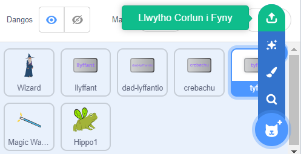

## Uwchraddio dy brosiect

Sut wnei di ehangu dy fud hudol? Gallet ti:
+ Ychwanegu rhagor o gymeriadau
+ Ychwanegu gwahanol effeithiau sain a gweledol i'r ffon hud.
+ Ychwanegu rhagor o swynion — fe allet ti wneud i gymeriadau ddiflannu ac ailymddangos gyda `cuddio`{:class="block3looks"} a `dangos`{:class="block3looks"}, defnyddio effeithiau gweledol neu eu troi wyneb i waered.

Beth am gyfnewid cymeriadau â ffrind? Yn gyntaf, cyfnewidia dolenni dy brosiectau gyda ffrind i weld eich corluniau eich gilydd. I gadw corluniau dy ffrind, defnyddia dy Scratch backpack neu lawrlwytho'r corluniau i fan sy'n cael ei rannu. Yna cer yn ôl at dy brosiect ac ychwanegu'r corluniau sydd wedi'u cadw.

[[[scratch-backpack]]]

--- collapse ---
---
title: Llwytho corlun i lawr
---

Galli di gadw corluniau i dy gyfrifiadur drwy eu llwytho i lawr o dy brosiect. De-glicia ar gorlun yn y rhestr Corluniau a dewis allforio.

I lwytho corlun i mewn i brosiect, dewisa'r opsiwn 'Llwytho Corlun i Fyny' o'r ddewislen 'Dewiswch Gorlun'.

--- /collapse ---

Galli di greu rhagor o swynion gyda ffrind a'u hychwanegu at dy gymeriadau. Penderfyna pa swynion i'w creu. Gwna'n siŵr fod y ddau ohonoch yn defnyddio'r un enw yn union ar gyfer y negeseuon rydych chi'n eu darlledu.

--- collapse ---
---
title: Prosiect gorffenedig
---

Galli di weld y [prosiect wedi'i gwblhau yma](https://scratch.mit.edu/projects/777389432/){:target="_blank"}.

--- /collapse ---

--- save ---
