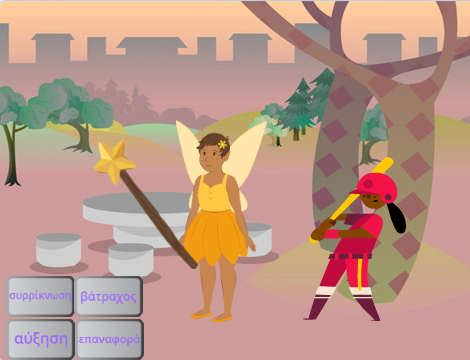

## Εισαγωγή

Δημιούργησε μια εφαρμογή όπου χρησιμοποιείς ένα μαγικό ραβδί για να μετατρέψεις τα αντικείμενα σε βατράχους και να τα μεγαλώνεις και να τα συρρικνώνεις.

Θα χρειαστεί να:
+ Δημιουργήσεις κουμπιά που `μεταδίδουν`{:class="block3events"} μηνύματα σε άλλα αντικείμενα
+ Ορίσεις πολλά αντικείμενα να ανταποκριθούν όταν `λάβουν`{:class="block3events"} το ίδιο μήνυμα
+ Χρησιμοποιήσεις το μενού μπλοκ `Ήχος`{:class="block3sound"} για να αντιστρέψεις ήχους

Η **Μετάδοση** και η **Λήψη** μηνυμάτων είναι σαν ένα μοτίβο κλήσης και απάντησης στη μουσική.
 
 
  "Το P3T3 P3T3 είναι ένα παραδοσιακό τραγούδι από την Γκάνα της Δυτικής Αφρικής. Εκτελείται από ένα κύριο άτομο που καλεί και μια ομάδα που ανταποκρίνεται επαναλαμβάνοντας μια φράση κλειδί όταν ακούει την κλήση." - Kwame Bakoji-Hume, African Activities (ΜΚΟ)

<audio controls><source src="images/Pete-Pete.mp3" type="audio/wav"></audio>  

--- no-print ---
--- task ---

### Δοκίμασέ το

  
Χρησιμοποίησε το μαγικό ραβδί για να κάνεις κλικ στα κουμπιά και να πραγματοποιήσεις ξόρκια. Τι κάνει κάθε ξόρκι στους χαρακτήρες;

  <iframe allowtransparency="true" width="485" height="402" src="https://scratch.mit.edu/projects/embed/656260416/?autostart=false" frameborder="0"></iframe>

--- /task ---
--- /no-print ---

--- print-only ---

--- /print-only ---

