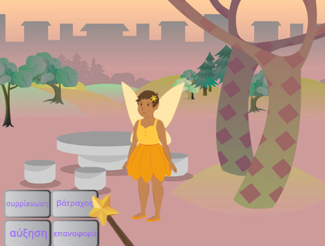
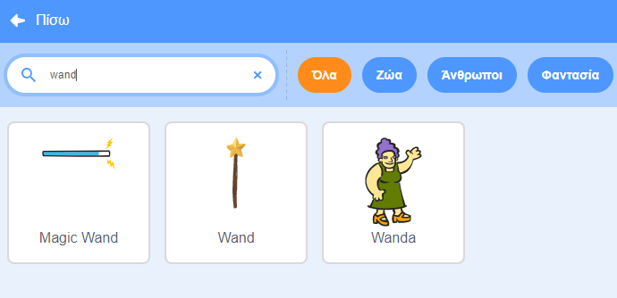
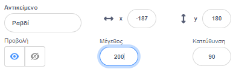
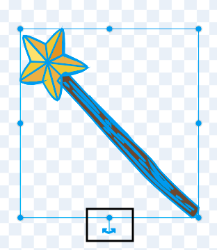
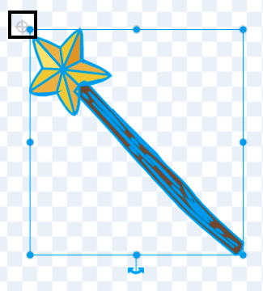

## Διάλεξε το ραβδί σου

<div style="display: flex; flex-wrap: wrap">
<div style="flex-basis: 200px; flex-grow: 1; margin-right: 15px;">
Σε αυτό το βήμα, θα ορίσεις τη σκηνή, θα επιλέξεις το ραβδί σου και θα δημιουργήσεις τη δική σου μαγεία με τη βοήθεια του υπολογιστή.
  
</div>
<div>
{:width="300px"}
</div>
</div>

<p style="border-left: solid; border-width:10px; border-color: #0faeb0; background-color: aliceblue; padding: 10px;">
Το <span style="color: #0faeb0">**CGI (που σημαίνει εικόνες που δημιουργούνται από υπολογιστή)**</span> μπορεί να χρησιμοποιηθεί για τη δημιουργία ειδικών εφέ που δεν συμβαίνουν στον πραγματικό κόσμο. Η δημιουργία μιας σύγχρονης ταινίας φαντασίας ή κινουμένων σχεδίων χρειάζεται πολύ κώδικα και τέχνη με τη βοήθεια υπολογιστή.
</p>

--- task ---

Άνοιξε το [αρχικό έργο Ξόρκια Μετάδοσης](https://scratch.mit.edu/projects/518441891/editor){:target="_blank"}. Το Scratch θα ανοίξει σε νέα καρτέλα του φυλλομετρητή.

[[[working-offline]]]

--- /task ---

--- task ---

Θα δεις μία νεράιδα σε ένα δάσος.


--- /task ---

Χρειάζεσαι ένα ραβδί για να εκτελέσεις ένα ξόρκι.

--- task ---

Κάνε κλικ στο **Επιλέξτε ένα Αντικείμενο** και πληκτρολόγησε `wand` (ραβδί) στο πλαίσιο αναζήτησης:




**Διάλεξε:** Πρόσθεσε το ραβδί που προτιμάς στο έργο σου.

--- /task ---

--- task ---

Πρόσθεσε κώδικα για να κάνεις το αντικείμενο **Ραβδί** να ακολουθεί τον `δείκτη ποντικιού`{:class="block3motion"} και να μένει `μπροστά`{:class="block3looks"} από τα κουμπιά:


```blocks3
when flag clicked
forever
go to (mouse-pointer v) //αλλαγή από "τυχαία θέση"     
go to [front v] layer // μπροστά από τα κουμπιά
end
```

--- /task ---

--- task ---

**Δοκιμή:** Κάνε κλικ στην πράσινη σημαία για να δοκιμάσεις το έργο σου. Το ραβδί θα ακολουθεί τον δείκτη του ποντικιού σου.

--- /task ---

Κάνε το ραβδί μεγαλύτερο και υπό κλίση, σαν να το χρησιμοποιείς πραγματικά.

--- task ---

Πήγαινε στο παράθυρο Αντικείμενα και άλλαξε την ιδιότητα **Μέγεθος** σε `200` για να κάνεις το ραβδί μεγαλύτερο:



--- /task ---

--- task ---

Κάνε κλικ στην καρτέλα **Ενδυμασίες** για να ανοίξεις την ενδυμασία του Ραβδιού στο πρόγραμμα ζωγραφικής.

Κάνε κλικ στο εργαλείο **Επιλογή** (βέλος) και στη συνέχεια σχεδίασε ένα ορθογώνιο γύρω από ολόκληρο το ραβδί για να επιλέξεις όλα τα μέρη της ενδυμασίας.


Στη συνέχεια, κάνε κλικ στο εικονίδιο **Ομαδοποίηση** για να συνδυάσεις τα μέρη του ραβδιού.


--- /task ---

--- task ---

Χρησιμοποίησε το εργαλείο **Περιστροφή** στο ραβδί για να τοποθετήσεις το ραβδί υπό γωνία.



**Συμβουλή:** Εάν δεν μπορείς να δεις το εργαλείο **Περιστροφή**, κάνε κλικ στο εργαλείο **Σμίκρυνση** (-) στο κάτω μέρος του προγράμματος επεξεργασίας ζωγραφικής για να μικρύνεις την εικόνα.

--- /task ---

Η ενδυμασία **Ραβδί** εμποδίζει τον δείκτη του ποντικιού όταν προσπαθείς να κάνεις κλικ στα κουμπιά.

--- task ---

Μετακίνησε το ραβδί έτσι ώστε η άκρη του να βρίσκεται λίγο μακριά από το σταυρόνημα στο κέντρο.



--- /task ---

--- task ---

**Δοκιμή:** Κάνε κλικ στην πράσινη σημαία και μετακίνησε το ποντίκι στη Σκηνή. Το ραβδί πρέπει να ακολουθεί το ποντίκι.

--- /task ---

--- task ---

Εάν είσαι συνδεδεμένος στον λογαριασμό σου στο Scratch, κάνε κλικ στο πράσινο κουμπί Ανάμειξη. Αυτή η ενέργεια θα αποθηκεύσει ένα αντίγραφο του έργου στον λογαριασμό σου στο Scratch.


Μπορείς να αλλάξεις τον τίτλο του έργου σου.


**Συμβουλή:** Δώσε στα έργα σου κατανοητά ονόματα, ώστε να μπορείς εύκολα να τα βρεις όταν έχεις πολλά έργα.

Εάν δεν έχεις λογαριασμό Scratch, μπορείς να κάνεις κλικ στο **Αρχείο** και στη συνέχεια στο **Αποθήκευση στον υπολογιστή σου** για να αποθηκεύσεις ένα αντίγραφο του έργου.

--- /task ---

--- save ---
