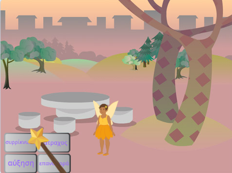
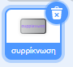
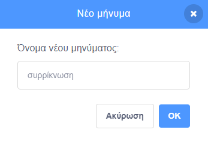
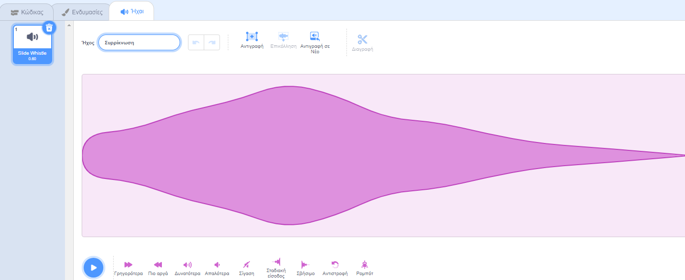

## Το ξόρκι συρρίκνωσης

<div style="display: flex; flex-wrap: wrap">
<div style="flex-basis: 200px; flex-grow: 1; margin-right: 15px;">
Τώρα θα κάνεις τη Νεράιδα να συρρικνωθεί όταν κάνεις κλικ στο κουμπί συρρίκνωσης.
</div>
<div>
{:width="300px"}
</div>
</div>

--- task ---

Κάνε κλικ στο αντικείμενο **συρρίκνωση** στη λίστα αντικειμένων.

Πρόσθεσε ένα μπλοκ `όταν γίνει κλικ σε αυτό το αντικείμενο`{:class="block3events"}:



```blocks3
when this sprite clicked
```

--- /task ---

Όταν κάνεις κλικ στο κουμπί συρρίκνωσης, το αντικείμενο **Νεράιδα** πρέπει να συρρικνωθεί.

Το αντικείμενο **συρρίκνωση** χρειάζεται να `μεταδώσει`{:class="block3events"} ένα `μήνυμα`{:class="block3events"} έτσι ώστε το αντικείμενο **Νεράιδα** να γνωρίζει ότι εκτελέστηκε το ξόρκι συρρίκνωσης.

--- task ---

Πρόσθεσε ένα μπλοκ `μετάδωσε`{:class="block3looks"}:


```blocks3
when this sprite clicked
+ broadcast (message1 v)
```

--- /task ---

--- task ---

Κάνε κλικ στο `μήνυμα1`{:class="block3events"} και επίλεξε "Νέο μήνυμα". Ονόμασε το νέο μήνυμα `συρρίκνωση`.



Ο κώδικας θα πρέπει να μοιάζει κάπως έτσι:


```blocks3
when this sprite clicked
broadcast (συρρίκνωση v)
```

--- /task ---

Τώρα, όταν κάνεις κλικ στο κουμπί **συρρίκνωση**, το Scratch θα `μεταδώσει`{:class="block3events"} το μήνυμα `συρρίκνωσης`{:class="block3events"}, αλλά τίποτα δεν θα συμβεί ακόμα.

--- task ---

Πρόσθεσε κώδικα στο αντικείμενο **Νεράιδα** για να συρρικνωθεί όταν λάβει ένα μήνυμα `συρρίκνωσης`{:class="block3events"}:


```blocks3
when I receive [συρρίκνωση v]
change size by [-10] // οι αρνητικοί αριθμοί μειώνουν το μέγεθος
```

--- /task ---

--- task ---

**Δοκιμή:** Κάνε κλικ στο κουμπί **συρρίκνωσης** για να συρρικνωθεί το αντικείμενο **Νεράιδα**. Κάνε αυτή την ενέργεια όσες φορές θέλεις.

**Εντοπισμός σφαλμάτων:** Εάν το αντικείμενο **Νεράιδα** μεγαλώνει αντί να μικραίνει, πρόσθεσε ένα μείον `-` πριν από τον αριθμό `10` για να τον μετατρέψεις στον αρνητικό αριθμό `-10`.

--- /task ---

--- task ---

Πρόσθεσε ένα script για να επαναφέρεις το αντικείμενο **Νεράιδα** σε κανονικό μέγεθος `όταν γίνει κλικ στην πράσινη σημαία`{:class="block3events"}:


```blocks3
when flag clicked
set size to [100] %
```

--- /task ---

Όταν τα μηνύματα `μεταδίδονται`{:class="block3events"} μπορούν να ληφθούν από όλα τα αντικείμενα. Όταν το **Ραβδί** `λάβει`{:class="block3events"} το μήνυμα `συρρίκνωσης`{:class="block3events"} πρέπει να `παίξει έναν ήχο`{:class="block3sound"}.

--- task ---

Κάνε κλικ στο αντικείμενο **Ραβδί** και μετά στην καρτέλα **Ήχοι**.

Πρόσθεσε τον ήχο **Slide Whistle**.

Μετονόμασε τον ήχο σε `συρρίκνωση` ώστε να είναι εύκολο να τον βρεις.




--- /task ---

--- task ---

Πρόσθεσε ένα script το οποίο να παίζει τον ήχο:


```blocks3
when I receive [συρρίκνωση v]
play sound [συρρίκνωση v] until done

```

--- /task ---

--- task ---

**Δοκιμή:** Κάνε κλικ στην πράσινη σημαία για να δοκιμάσεις το έργο σου. Κάνε κλικ στο κουμπί **συρρίκνωση** για να ακούσεις τον ήχο και να δεις τη **Νεράιδα** να συρρικνώνεται.

--- /task ---

Το κουμπί **συρρίκνωση** `μεταδίδει`{:class="block3events"} ένα μήνυμα `συρρίκνωσης`{:class="block3events"}. Τόσο το αντικείμενο **Νεράιδα** όσο και το **Ραβδί** `έλαβαν`{:class="block3events"} το μήνυμα και ανταποκρίθηκαν.

--- save ---
