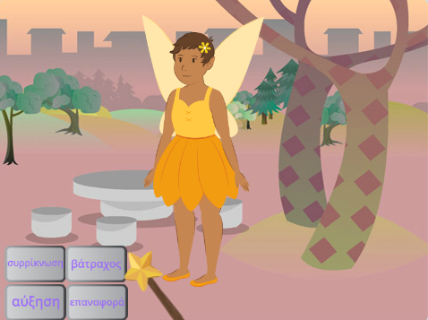
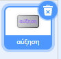
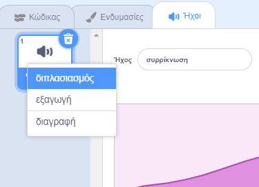
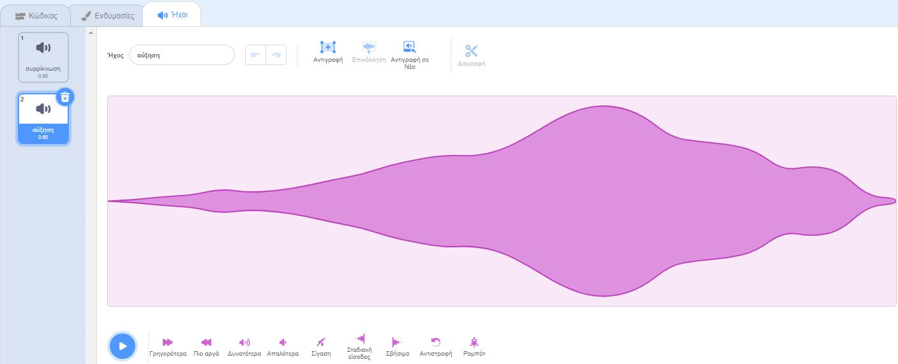

## Το ξόρκι αύξησης

<div style="display: flex; flex-wrap: wrap">
<div style="flex-basis: 200px; flex-grow: 1; margin-right: 15px;">
Χρειάζεται επίσης ένα ξόρκι αύξησης για να επαναφέρεις το αντικείμενο **Νεράιδα** σε κανονικό μέγεθος ή για να την μετατρέψεις σε μια τεράστια νεράιδα!
</div>
<div>
{:width="300px"}
</div>
</div>

**Συμβουλή:** Σε αυτό το βήμα, θα προσθέσεις κώδικα σε τρία διαφορετικά αντικείμενα. Βεβαιώσου ότι έχεις επιλέξει το σωστό αντικείμενο από τη λίστα Αντικειμένων κάτω από το Σκηνικό και κάνε κλικ στην καρτέλα **Κώδικας**.

--- task ---

Πρόσθεσε ένα script στο αντικείμενο κουμπιού **αύξησης** για να `μεταδώσει`{:class="block3events"} ένα μήνυμα `αύξησης`{:class="block3events"}:



```blocks3
when this sprite clicked
broadcast (grow v)
```

--- /task ---

--- task ---

Πρόσθεσε ένα script για να αυξήσεις το μέγεθος του αντικειμένου **Νεράιδα**:


```blocks3
when I receive [grow v]
change size by [10] // positive numbers increase the size
```

--- /task ---

Μπορείς να αντιστρέψεις τον ήχο "συρρίκνωση" για να δημιουργήσεις έναν ήχο "αύξησης"!

<p style="border-left: solid; border-width:10px; border-color: #0faeb0; background-color: aliceblue; padding: 10px;">
Τα <span style="color: #0faeb0">**κουίζ με τραγούδια που παίζονται αντίστροφα**</span> είναι μουσικά κουίζ με μία ανατροπή. Τα κομμάτια αντιστρέφονται και οι διαγωνιζόμενοι πρέπει να μαντέψουν το αρχικό τραγούδι — δεν είναι τόσο εύκολο όσο ακούγεται. 
</p>

--- task ---

Επίλεξε το αντικείμενο **Ραβδί** και κάνε κλικ στην καρτέλα **Ήχοι**.

Κάνε δεξί κλικ (ή πάτησε παρατεταμένα) στον ήχο **συρρίκνωση** και επίλεξε **διπλασιασμός**.




Ονόμασε το αντίγραφο `αύξηση`.

Κάνε κλικ στο εικονίδιο **Αντιστροφή** για να αναπαράγεις τον ήχο προς τα πίσω.



--- /task ---

--- task ---

Πρόσθεσε ένα script στο αντικείμενο **Ραβδί** έτσι ώστε να αναπαράγει τον ήχο `αύξηση`{:class="block3sound"} όταν ληφθεί το μήνυμα `αύξηση`{:class="block3events"}:


```blocks3
when I receive [grow v]
play sound [grow v] until done
```

--- /task ---

--- task ---

**Δοκιμή:** Κάνε κλικ στα κουμπιά ξορκιών **συρρίκνωση** και **αύξηση** για να κάνεις τα ξόρκια όσες φορές θέλεις.

--- /task ---

--- save ---

