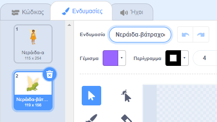

## Μεταμόρφωση σε βάτραχο

<div style="display: flex; flex-wrap: wrap">
<div style="flex-basis: 200px; flex-grow: 1; margin-right: 15px;">
Τώρα ήρθε η ώρα για ένα άλλο ξόρκι. Αυτή τη φορά θα κάνεις ένα ξόρκι μεταμόρφωσης μεταδίδοντας ένα μήνυμα `βάτραχος`{:class="block3events"} που μετατρέπει το αντικείμενο **Νεράιδα** σε βάτραχο! 

Πιθανόν να χρειαστεί να πάει σε μια περιπέτεια όπου το να είναι βάτραχος θα είναι πιο χρήσιμο.
</div>
<div>
{:width="300px"}
</div>
</div>

--- task ---

Πρόσθεσε ένα script στο αντικείμενο κουμπιού **βάτραχος** για να μεταδώσεις το μήνυμα "βάτραχος":


```blocks3 
when this sprite clicked
broadcast [toad v]
```

--- /task ---

--- task ---

Επίλεξε το αντικείμενο **Νεράιδα** και κάνε κλικ στην καρτέλα **Ενδυμασίες**.

Για να μετατρέψετε το αντικείμενο **Νεράιδα** σε βάτραχο, θα χρησιμοποιήσεις τις ενδυμασίες **Νεράιδα-α** και **Νεράιδα-βάτραχος-α**.



--- /task ---

--- task ---

Κάντε κλικ στην καρτέλα **Κώδικας** και πρόσθεσε ένα μπλοκ `άλλαξε ενδυμασία σε`{:class="block3looks"} στο τέλος του υπάρχοντος script `όταν γίνει κλικ στην πράσινη σημαία`{:class="block3events"}, ώστε η Νεράιδα να είναι σε ανθρώπινη μορφή όταν εκτελείς το έργο σου:


```blocks3
when flag clicked
set size to [100] %
+ switch costume to [Fairy-a v]
```

--- /task ---

--- task ---

Πρόσθεσε ένα νέο script στο αντικείμενο **Νεράιδα** για να μεταμορφωθεί σε βάτραχο:


```blocks3  
when I receive [toad v]
switch costume to [Fairy-toad-a v]
```

--- /task ---

--- task ---

Πρόσθεσε τον ήχο **Croak** στο αντικείμενο **Ραβδί**.

Μετονόμασε τον ήχο σε `βάτραχος`:


--- /task ---

--- task ---

Πρόσθεσε ένα script στο αντικείμενο **Ραβδί** για να παίξεις τον ήχο `βάτραχος`{:class="block3sound"} όταν εκτελείται το ξόρκι του βάτραχου:


```blocks3  
when I receive [toad v]
play sound [toad v] until done
```

--- /task ---

--- task ---

**Δοκιμή:** Δοκίμασε να μετατρέψεις την **Νεράιδα** σε βάτραχο, με ένα ηχητικό εφέ, όταν κάνεις κλικ στο κουμπί **βάτραχος**. Κάνε ξανά κλικ στην πράσινη σημαία για να μετατρέψεις το αντικείμενο **Νεράιδα** ξανά σε άνθρωπο.


--- /task ---

Το αντίθετο από το ξόρκι «βάτραχος» είναι ένα ξόρκι «επαναφοράς».

--- task ---

Πρόσθεσε ένα script στο αντικείμενο κουμπιού **επαναφοράς** ώστε να `μεταδώσει`{:class="block3events"} το μήνυμα 'επαναφοράς'{:class="block3events"}:


```blocks3 
when this sprite clicked
broadcast [untoad v]
```

--- /task ---

--- task ---

Πρόσθεσε ένα νέο script για να `επαναφέρεις`{:class="block3events"} το αντικείμενο **Νεράιδα**:


```blocks3  
when I receive [untoad v]
switch costume to [Fairy-a v]
```

--- /task ---

--- task ---

Επίλεξε το αντικείμενο **Ραβδί** και πήγαινε στην καρτέλα **Ήχοι**.

**Διπλασίασε** τον ήχο **βάτραχος** και μετονόμασέ τον σε `επαναφορά`.

Κάνε κλικ στο εικονίδιο **Αντιστροφή** για να ακούσεις τον ήχο **επαναφοράς** να παίζει αντίστροφα.


--- /task ---

--- task ---

Πρόσθεσε ένα script στο αντικείμενο **Ραβδί** για να παίξεις τον ήχο `επαναφοράς`{:class="block3sound"}:


```blocks3  
when I receive [untoad v]
play sound [untoad v] until done
```

--- /task ---

--- task ---

**Δοκιμή:** Δοκίμασε τα ξόρκια **βάτραχος** και **επαναφορά**, και δοκίμασε τα **συρρίκνωση** και **αύξηση** όταν η **Νεράιδα** είναι σε μορφή βατράχου.

--- /task ---

--- save ---
