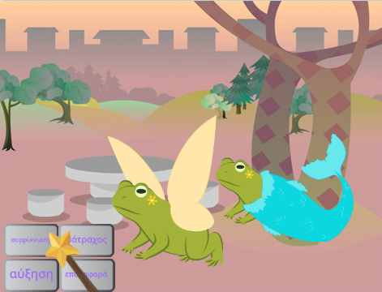
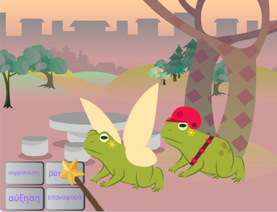
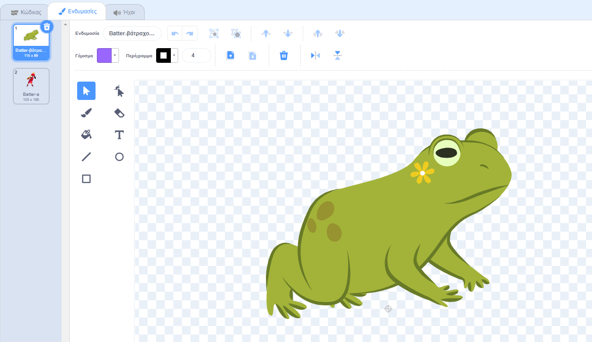
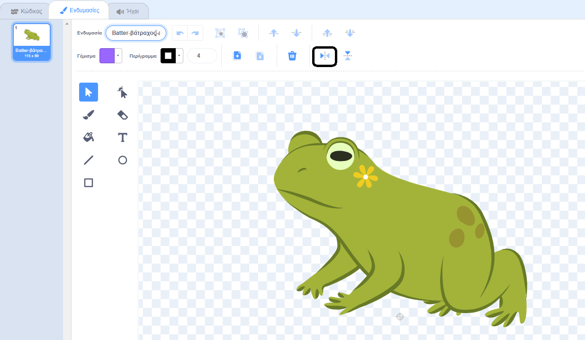

## Προσθήκη νέου χαρακτήρα

Επίλεξε ένα δικό σου αντικείμενο για να ανταποκρίνεται στα ξόρκια. Θα χρειαστεί να δημιουργήσεις μία ανάμειξη ενδυμασίας βατράχου για το αντικείμενο και να προσθέσεις κώδικα, ώστε η ενδυμασία να αλλάζει όταν μεταδίδονται τα μηνύματα ξορκιών.

{:width="300px"}

--- task ---

Διπλασίασε το αντικείμενο της **Νεράιδας**.

Διάγραψε τις ενδυμασίες **Νεράιδα-α** και **Νεράιδα-βάτραχος-α**. Θα σου μείνει μία ενδυμασία **βάτραχος**.

Πρόσθεσε μία ενδυμασία της επιλογής σου στο **νέο αντικείμενο**.

Επιλέξαμε το **Batter**:

Ίσως θέλεις να αλλάξεις την κατεύθυνση προς την οποία δείχνει το αντικείμενο.

**Συμβουλή:** Εάν το αντικείμενο σου δείχνει ανάποδα, μπορείς να αλλάξεις το `στυλ περιστροφής`{:class="block3motion"} σε `αριστερά-δεξιά`{:class="block3motion"} στο παράθυρο ιδιοτήτων αντικειμένου ή χρησιμοποιώντας ένα μπλοκ κώδικα.

--- /task ---

Όταν μεγαλώνεις ή συρρικνώνεις ένα αντικείμενο, τα πόδια χρειάζεται να παραμένουν στην ίδια θέση.

--- task ---

Χρησιμοποίησε πρώτα το εργαλείο **Επιλογή** (βέλος) για να σχεδιάσεις ένα ορθογώνιο γύρω από ενδυμασία και μετά επίλεξε την **Ομαδοποίηση**. Στη συνέχεια, σύρε τον χαρακτήρα σου πάνω στο σταυρόνημα.

--- /task ---

--- task ---

Κάνε κλικ στην ενδυμασία **βάτραχος**.

Μετονόμασε την ενδυμασία για να ταιριάζει με το αντικείμενό σου, για παράδειγμα **Batter-βάτραχος-a**.

--- /task ---

--- task ---

Εάν η ενδυμασία του βατράχου είναι στραμμένη προς την αντίθετη πλευρά από την κύρια ενδυμασία, μπορείς να χρησιμοποιήσεις την **Οριζόντια Αναστροφή**.

--- /task ---

Τώρα πρέπει να κάνεις τον βάτραχο να μοιάζει με τον χαρακτήρα. Ο συνδυασμός δύο ενδυμασιών με αυτόν τον τρόπο ονομάζεται 'ανάμειξη'.

--- task ---

Μπορείς να προσθέσεις μια μικρή λεπτομέρεια, όπως μια πινελιά χρώματος, ή να αντιγράψεις και να επικολλήσεις γυαλιά ηλίου ή ένα καπέλο στο πρόγραμμα επεξεργασίας ζωγραφικής.

**Συμβουλή:** Μπορείς να προσθέσεις οποιαδήποτε ενδυμασία στο αντικείμενο του χαρακτήρα σου. Χρησιμοποίησε το εργαλείο **Επιλογή** (βέλος) και μετά κάνε κλικ στην **Αντιγραφή** ή την **Επικόλληση**.

**Συμβουλή:** Μπορείς να ομαδοποιήσεις όλα τα αντικείμενα σε μία ενδυμασία. Επίλεξέ τα (με το εργαλείο **Επιλογή** ή <kbd>Ctrl-a</kbd>) και μετά κάνε κλικ στην **Ομαδοποίηση**.

Ο βάτραχος Batter μας μοιάζει με το εξής: 

--- /task ---

--- task ---

Πήγαινε στην καρτέλα **Κώδικας** για το νέο αντικείμενό σου.

Άλλαξε όλα τα μπλοκ `άλλαξε ενδυμασία`{:class="block3looks"} για να χρησιμοποιήσεις τις σωστές ενδυμασίες για το νέο σου αντικείμενο.

Μπορεί επίσης να θέλεις να αλλάξεις το αρχικό `μέγεθος`{:class="block3looks"} του αντικειμένου `όταν γίνει κλικ στην πράσινη σημαία`{:class="block3events"}.

--- /task ---

--- task ---

**Δοκιμή:** Κάνε κλικ στα κουμπιά ξορκιών — και οι δύο χαρακτήρες πρέπει να ανταποκρίνονται στις μεταδόσεις ξορκιών.

**Εντοπισμός σφαλμάτων:** Έλεγξε ότι έχεις αλλάξει τις ενδυμασίες στο μπλοκ `άλλαξε ενδυμασία`{:class="block3looks"} για το νέο σου αντικείμενο.

--- /task ---

--- save ---
