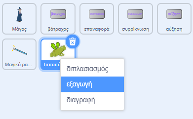

## Αναβάθμιση του έργου σου

Πώς θα διευρύνεις τον μαγικό σου κόσμο; Θα μπορούσες να:
+ Πρόσθεσε περισσότερους χαρακτήρες
+ Πρόσθεσε διαφορετικό ήχο και οπτικά εφέ στο ραβδί.
+ Πρόσθεσε περισσότερα ξόρκια — θα μπορούσες να κάνεις τους χαρακτήρες να εξαφανίζονται και να επανεμφανίζονται με τα μπλοκ `εξαφανίσου`{:class="block3looks"} και `εμφανίσου`{:class="block3looks"}, να εφαρμόσεις οπτικά εφέ ή να τους γυρίσεις ανάποδα.

Γιατί να μην ανταλλάξεις χαρακτήρες με έναν φίλο; Πρώτα, αντάλλαξε το σύνδεσμο του έργου σου με έναν φίλο για να δείτε ο ένας τα αντικείμενα του άλλου. Για να αποθηκεύσεις τα αντικείμενά του, χρησιμοποίησε το σακίδιο πλάτης του Scratch ή κάνε download τα αντικείμενα σε μια κοινόχρηστη περιοχή. Στη συνέχεια, επέστρεψε στο έργο σου και πρόσθεσε τα αποθηκευμένα αντικείμενα.

[[[scratch-backpack]]]

--- collapse ---
---
title: Κατέβασε ένα αντικείμενο
---

Μπορείς να αποθηκεύσεις αντικείμενα στον υπολογιστή σου κατεβάζοντάς τα από το έργο σου. Κάνε δεξί κλικ σε ένα αντικείμενο στη λίστα Αντικειμένων και επίλεξε εξαγωγή.

Για να φορτώσεις ένα αντικείμενο σε ένα έργο, επίλεξε την επιλογή 'Μεταφόρτωση Αντικειμένου' από το μενού 'Επιλέξτε ένα Αντικείμενο'.

--- /collapse ---

Δημιούργησε περισσότερα ξόρκια με έναν φίλο και πρόσθεσέ τα στους χαρακτήρες σου. Αποφάσισε ποια ξόρκια θα δημιουργήσεις. Βεβαιώσου ότι χρησιμοποιούν και οι δύο ακριβώς το ίδιο όνομα για τα μηνύματα που εκπέμπεις.

--- collapse ---
---
title: Ολοκληρωμένο έργο
---

Μπορείς να δεις [ολοκληρωμένο το έργο εδώ](https://scratch.mit.edu/projects/656260416/){:target="_blank"}.

--- /collapse ---

--- save ---
