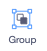

## Choose your wand

<div style="display: flex; flex-wrap: wrap">
<div style="flex-basis: 200px; flex-grow: 1; margin-right: 15px;">
In this step, you will set the scene, choose your wand and create your own computer-generated magic.
  
</div>
<div>
{:width="300px"}
</div>
</div>

<p style="border-left: solid; border-width:10px; border-color: #0faeb0; background-color: aliceblue; padding: 10px;">
<span style="color: #0faeb0">**Computer-generated imagery (CGI)**</span> can be used to create special effects that don't happen in the real world. Making a modern fantasy movie or animation involves lots of code and computer art.
</p>

--- task ---

Open the [Broadcasting spells starter project](https://scratch.mit.edu/projects/518441891/editor){:target="_blank"}. Scratch will open in another browser tab.

[[[working-offline]]]

--- /task ---

--- task --- You should see a fairy in a woodland.


--- /task ---

You need a wand to cast a spell.

--- task ---

Click **Choose a Sprite** and type `wand` into the search box:


**Choose:** Add the wand you prefer to your project.

--- /task ---

--- task ---

Add code to make the **Wand** sprite follow the `mouse pointer`{:class="block3motion"} and stay in `front`{:class="block3looks"} of the buttons:


```blocks3
when flag clicked
forever
go to (mouse-pointer v) //change from 'random position'     
go to [front v] layer // in front of the buttons
end
```
--- /task ---

--- task ---

**Test:** Click on the green flag to run your project. The wand will follow your mouse pointer.

--- /task ---

Make the wand bigger and tilted, like you’re really using it.

--- task ---

Go to the Sprite pane and change the **Size** property to `200` to make the wand bigger:


--- /task ---

--- task ---

Click on the **Costumes** tab to open the Wand costume in the Paint editor.

Click on the **Select** (Arrow) tool and then draw a rectangle around the whole wand to select all of the parts of the costume.


Then click on the **Group** icon to combine the wand parts.



--- /task ---

--- task ---

Use the **Rotate** tool on the wand to position the wand at an angle.


**Tip:** If you can't see the **Rotate** tool, click the **Zoom out** (-) tool at the bottom of the Paint editor to zoom out.

--- /task ---

The **Wand** costume gets in the way of the mouse cursor when you try to click the buttons.

--- task ---

Move the wand so that its tip is just away from the crosshair in the centre.


--- /task ---

--- task --- **Test:** Click the green flag and move the mouse around the Stage. The wand should follow.  
--- /task ---

--- task ---

If you are signed in to your Scratch account, click on the green Remix button. This will save a copy of the project to your Scratch account.


You can change the title of your project.


**Tip:** Give your projects helpful names so that you can easily find them when you have lots of projects.

If you do not have a Scratch account, you can click on **File** then **Save to your computer** to save a copy of the project.

--- /task ---

--- save ---
