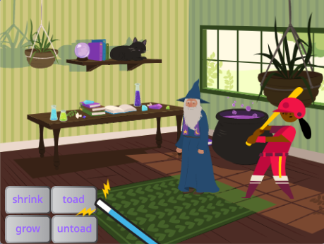

## Introduction
Use a magic wand to choose spells and broadcast spell messages to turn sprites into toads and grow and shrink them.

**Broadcasting messages** is like shouting out a message to everyone in a game. In the game Marco Polo, one person closes their eyes and counts to ten then shouts 'Marco'. The other players then shout 'Polo'. The one who shouted 'Marco' keeps their eyes closed and tries to catch one of the others, they can shout 'Marco' again to get more 'Polo' responses. The story is that the famous explorer Marco Polo once got separated from his family and they called 'Marco' and he responded with 'Polo'.

You will:
+ Click on buttons to `broadcast`{:class="block3events"} messages to other sprites
+ Get multiple sprites to respond when they `receive`{:class="block3events"} the same message
+ Use the `Sound`{:class="block3sound"} editor to reverse sounds

--- no-print ---
--- task ---
### Try it

  
Try it: Click on the buttons with the magic wand to cast spells on the characters and watch what happens.

  <iframe allowtransparency="true" width="485" height="402" src="https://scratch.mit.edu/projects/embed/518413238/?autostart=false" frameborder="0"></iframe>

--- /task ---
--- /no-print ---

--- print-only ---

--- /print-only ---
