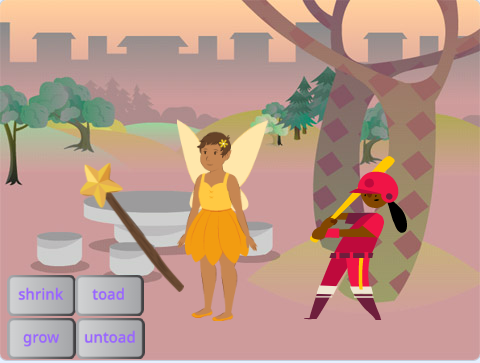

## Introduction
Use a magic wand to choose spells and broadcast spell messages to turn sprites into toads and grow and shrink them.

**Term** description of term or interesting phrase.

You will:
+ Click on buttons to `broadcast`{:class="block3events"} messages to other sprites
+ Get multiple sprites to respond when they `receive`{:class="block3events"} the same message
+ Use the `Sound`{:class="block3sound"} editor to reverse sounds

--- no-print ---
--- task ---
### Try it

  
Try it: Click on the buttons with the magic wand to cast spells on the characters and watch what happens.

  <iframe allowtransparency="true" width="485" height="402" src="https://scratch.mit.edu/projects/embed/518413238/?autostart=false" frameborder="0"></iframe>

--- /task ---
--- /no-print ---

--- print-only ---

--- /print-only ---
