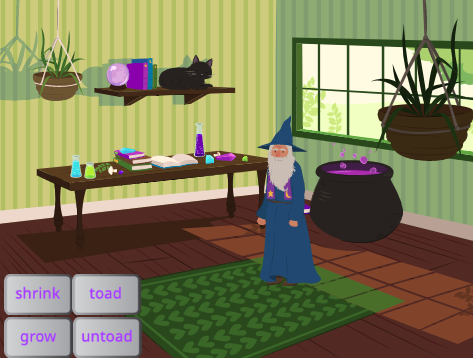
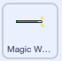
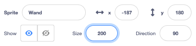
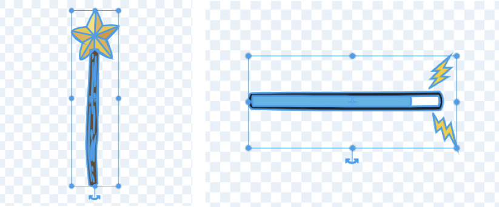
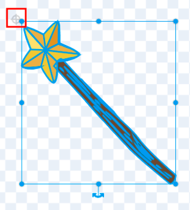

## Choosing your wand

<div style="display: flex; flex-wrap: wrap">
<div style="flex-basis: 200px; flex-grow: 1; margin-right: 15px;">
In this step, you will set the scene and choose your wand and get it ready for magic.
</div>
<div>
Image, gif or video showing what they will achieve by the end of the step. {:width="300px"}
</div>
</div>

--- task ---

Open the [Broadcasting spells starter project](https://scratch.mit.edu/projects/518441891/){:target="_blank"}. Scratch will open in another browser tab.

[[[working-offline]]]

--- /task ---

--- task ---

You should see the Witch House backdrop with Wizard and button sprites:



--- /task ---

Every good Wizard needs a wand.

--- task ---

Click 'Choose a Sprite' and type 'wand' into the search box: 


**Choose:** Add the wand you prefer to your project.

--- /task ---

--- task ---

Add code to make the Wand sprite follow the mouse pointer and stay in front of the buttons:



```blocks3
when flag clicked
forever
go to (mouse-pointer v)
go to [front v] layer // in front of the buttons
end
```
--- /task ---

--- task ---

**Test:** Click on the green flag to run your project, the wand will follow your mouse pointer. 

At the moment the wand doesn't look like you are holding it and is too small. 

--- /task ---

--- task ---

Got to the Sprite pane and change the **Size** property to '200' to make the wand bigger:



--- /task ---

To be able to click on the buttons you need to move the 'centre' of the sprite costume so that it doesn't get in the way of the mouse cursor (or your finger on a tablet).

--- task ---

Open the Wand costume in the Paint editor.

Click on the 'Select' (Arrow) tool and then draw a rectangle around the whole wand to select all of the parts of the costume. 




Then click on 'Group' to combine the wand parts.


--- /task ---

--- task ---

Move the Wand so that it's tip is just away from the centre. 

Use the 'rotate' handle on the wand to position the wand at an angle.

<mark>Check whether wand costumes are grouped</mark>



--- /task ---

--- task ---
**Test:** Click the green flag and move the mouse around the Stage. The wand should follow.  
--- /task ---

--- task ---

If you are signed in to your Scratch account, click on the green Remix button. This will save a copy of the project to your Scratch account.  


You can change the title of your project into the project title box at the top of the screen.


**Tip:** Give your projects helpful names so that you can easily find them when you have lots of projects. 

If you do not have a Scratch account, you can click on **File** then **Save to your computer** to save a copy of the project.

--- /task ---

--- save ---