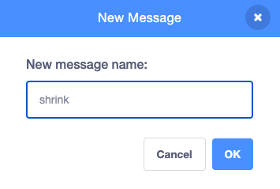

## The shrinking spell

<div style="display: flex; flex-wrap: wrap">
<div style="flex-basis: 200px; flex-grow: 1; margin-right: 15px;">
Now you will get the Fairy to shrink when you click on the shrink button.
</div>
<div>
{:width="300px"}
</div>
</div>

--- task ---

Click on the **shrink** sprite in the Sprite list below the stage. 

Add a `when this sprite clicked`{:class="block3events"} block:


```blocks3
when this sprite clicked
```

--- /task ---

When you click on the shrink button you want the **Fairy** sprite to shrink. 

The **shrink** sprite needs to `broadcast`{:class="block3events"} a `message`{:class="block3events"} so that the **Fairy** sprite knows that the shrink spell has been cast.

--- task ---

Add a `broadcast`{:class="block3events"} block:


```blocks3
when this sprite clicked
+ broadcast (message1 v)
```

--- /task ---

--- task ---

Click on `message1`{:class="block3events"} and choose 'New message'. Name the new message `shrink`.



Your code should look like this:


```blocks3
when this sprite clicked
broadcast (shrink v)
```

--- /task ---

Now when you click on the **shrink** button, Scratch will `broadcast`{:class="block3events"} the `shrink` message but nothing will happen yet.

--- task ---

Add code to the **Fairy** sprite to shrink when it recieves a `shrink` message:


```blocks3
when I receive [shrink v]
change size by [-10] // negative numbers decrease the size
```
--- /task ---

--- task ---

**Test:** Click on the **shrink** button to shrink the **Fairy** sprite. Do this as many times as you like.

**Debug:** If your **Fairy** sprite grows instead of shrinks, add a minus `-` before the number `10` to make a negative number `-10`.

--- /task ---

--- task ---

Add a script to set the **Fairy** sprite to normal size `when the green flag`{:class="block3events"} is clicked:


```blocks3
when flag clicked
set size to [100] %
```
--- /task ---

When messages are `broadcast`{:class="block3events"} they can be received by all sprites. When the **Wand** `receives`{:class="block3events"} the `shrink` message it should `play a sound `{:class="block3sound"}.

--- task ---

Click on the **Wand** sprite and then the **Sounds** tab.

Add the **Slide whistle** sound.

Rename the sound to `shrink` so it is easy to find.


--- /task ---

--- task ---

Add a script to play the sound:


```blocks3
when I receive [shrink v]
play sound [shrink v] until done

```
--- /task ---

--- task ---

**Test:** Click on the green flag to run your project. Click on the **shrink** button to hear the sound and see the **Fairy** shrink.

--- /task ---

The **shrink** button `broadcast`{:class="block3events"} a `shrink`{:class="block3events"} message. Both the **Fairy** and the **Wand** sprite `received`{:class="block3events"} the message and responded.

--- save ---
