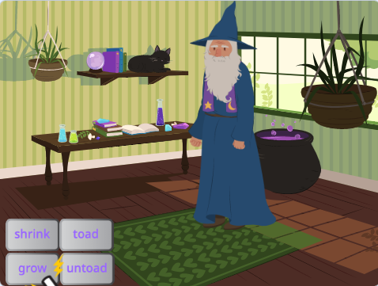

## The growing spell

<div style="display: flex; flex-wrap: wrap">
<div style="flex-basis: 200px; flex-grow: 1; margin-right: 15px;">
You also need a growing spell to return the **Wizard** sprite to normal size - or make a massive Wizard!
</div>
<div>
{:width="300px"}
</div>
</div>

**Tip:** In this step you will add code to three different sprites. Make sure you select the correct sprite from the Sprite list below the Stage and click on the **Code** tab.

--- task ---

Add a script to the **grow** button sprite to broadcast the 'grow' message:


```blocks3
when this sprite clicked
broadcast (grow v)
```

--- /task ---

--- task ---

Add a script to get he **Wizard** sprite to grow:


```blocks3
when I receive [grow v]
change size by [10] // positive numbers increase the size
```
--- /task ---

You can reverse the 'shrink' sound to make a 'grow' sound!

<p style="border-left: solid; border-width:10px; border-color: #0faeb0; background-color: aliceblue; padding: 10px;">
<span style="color: #0faeb0">**Songs played backwards quizzes**</span> are music quizzes with a twist. The tracks are reversed and contestants have to guess the original song - it is not as easy as it sounds. 
</p>

--- task ---

Select the **Wand** sprite and click on the **Sounds** tab.

Right-click (or tap and hold) the 'shrink' sound and choose 'duplicate'. 


Name the copy 'grow'.

Click on the **Reverse** icon to make the sound play backwards.


--- /task ---

--- task ---

Add a script to the **Wand** sprite to play the 'grow' sound when the 'grow' message is receieved:


```blocks3
when I receive [grow v]
play sound [grow v] until done
```

--- /task ---

--- task ---

**Test:** Click on the shrink and grow spell buttons to cast the spells as many times as you like.

--- /task ---

--- save ---

