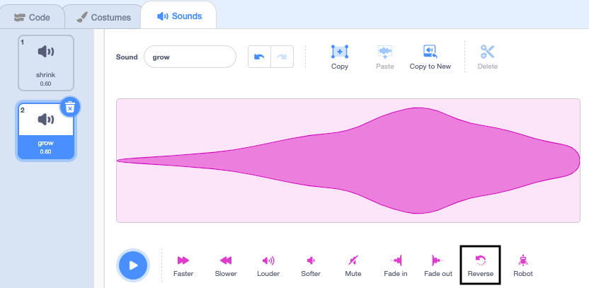

## The growing spell

You also need a growing spell to return the Wizard to normal size - or make a massive Wizard!

**Tip:** In this step you will add code to three different sprites. Make sure you select the correct sprite from the Sprite list below the Stage and click on the 'Code' tab.

--- task ---

Add a script to the **grow** button sprite to broadcast the 'grow' message:


```blocks3
when this sprite clicked
broadcast (grow v)
```

--- /task ---

--- task ---

Add a script to the **Wizard** sprite to grow:


```blocks3
when I receive [grow v]
change size by [10] / positive numbers increase the size
```
--- /task ---

You can reverse the 'shrink' sound to make a 'grow' sound!

--- task ---

Select the **Wand** sprite and click on the 'Sounds' tab.

Duplicate the 'shrink' sound and name the copy 'grow'.


Click on 'Reverse' to make the sound play backwards.



--- /task ---

--- task ---

Add a script to the **Wand** sprite to play the 'grow' sound when the 'grow' message is receieved:


```blocks3
when I receive [grow v]
play sound [grow v] until done
```

--- /task ---

--- task ---

**Test:** Click on the shrink and grow spell buttons to cast the spells as many times as you like.

--- /task ---

--- save ---

