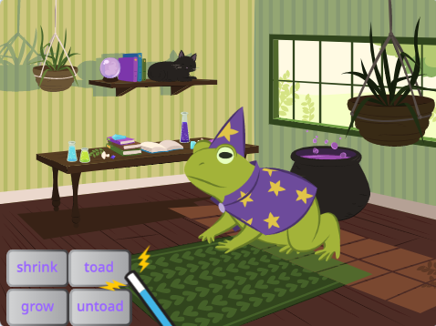
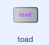
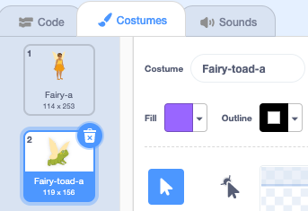
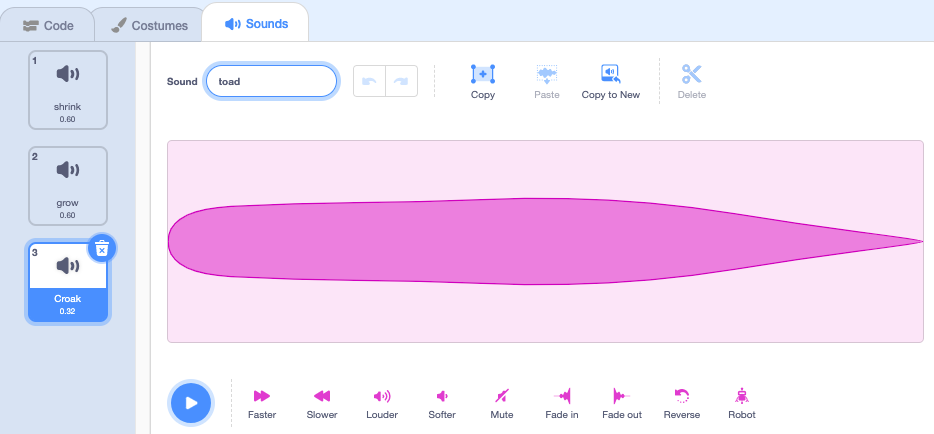

## Toad transformation

<div style="display: flex; flex-wrap: wrap">
<div style="flex-basis: 200px; flex-grow: 1; margin-right: 15px;">
Now it's time for another spell. This time you're going to cast a transformation spell by broadcasting a `toad`{:class="block3events"} message that turns the **Fairy** sprite into a toad! 

</div>
<div>
{:width="300px"}
</div>
</div>

--- task ---

Add a script to the **toad** button sprite to broadcast the 'toad' message:



```blocks3 
when this sprite clicked
broadcast [toad v]
```

--- /task ---

--- task ---

Select the **Fairy** sprite and click on the **Costumes** tab.  


--- /task ---

To transform the **Fairy** sprite into a toad you will use the **Fairy-a** and **Fairy-toad-a** costumes. 



--- /task ---

--- task ---

Click on the **Code** tab and add a `switch costume to`{:class="block3looks"} block to the end of your existing `when flag clicked`{:class="block3events"} script so the Fairy is in human form when you run your project:

```blocks3
when flag clicked
set size to [100] %
+ switch costume to [Fairy-a v]
```

--- /task ---

--- task ---

Add a new script to the **Fairy** sprite to turn into a toad:

```blocks3  
when I receive [toad v]
switch costume to [Fairy-toad-a v]
```

--- /task ---

--- task ---

Select the **Wand** sprite.


--- /task ---

--- task ---

Add the **Croak** sound to the **Wand** sprite.

Rename the sound to `toad`:



--- /task ---

--- task ---

Add a script to the **Wand** sprite to play the `toad`{:class="block3sound"} sound when the toad spell is cast:

```blocks3  
when I receive [toad v]
play sound [toad v] until done
```

--- /task ---

--- task ---

**Test:** Test that you can turn the **Fairy** into a toad, with a sound effect, when you click the **toad** button. Click on the green flag again to turn the **Fairy** sprite back into a human.


--- /task ---

The opposite of a 'toad' spell is an 'untoad' spell.

--- task ---

Select the **untoad** button sprite.


--- /task ---

--- task ---

Add a script to `broadcast`{:class="block3events"} the 'untoad'{:class="block3events"} message:

```blocks3 
when this sprite clicked
broadcast [untoad v]
```

--- /task ---

--- task ---

Add a new script to `untoad`{:class="block3events"} the **Fairy** sprite:


```blocks3  
when I receive [untoad v]
switch costume to [Fairy-a v]
```

--- /task ---

--- task ---

Select the **Wand** sprite 


--- /task ---

--- task ---

Switch to the **Sounds** tab and **duplicate** the **toad** sound. 

Rename it to `untoad`. 

--- /task ---

--- task ---

Click on the **Reverse** icon so that the **untoad** sound plays backwards.


--- /task ---

--- task ---

Add a script to the **Wand** sprite to play the `untoad`{:class="block3sound"} sound:

```blocks3  
when I receive [untoad v]
play sound [untoad v] until done
```

--- /task ---

--- task ---

**Test:** Try the **toad** and **untoad** spells, and try **shrink** and **grow** when the **Fairy** is in toad form.

--- /task ---

--- save ---
