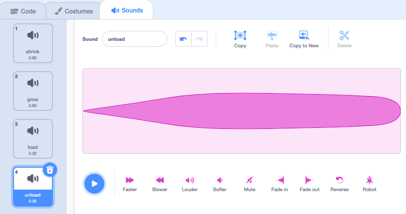

## Toad transformation

Now for another spell. This time you're going to cast a transformation spell by broadcasting a 'toad' message that turns the Wizard into a toad!

--- task ---

Add a script to the **toad** button sprite to broadcast the 'toad' message:


```blocks3 
when this sprite clicked
broadcast [toad v]
```
--- /task ---

--- task ---

Select the Wizard sprite and click on the 'Costumes' tab. 

Add the 'Wizard-toad-a' costume.


--- /task ---

--- task ---

Add a `switch costume to`{:class="block3looks"} block to the end of your existing `when flag clicked`{:class="block3events"} script so the Wizard is in human form when you run your project:


```blocks3
when flag clicked
set size to [100] %
+ switch costume to [wizard-a v]
```

--- /task ---

--- task ---

Add a new script to the **Wizard** sprite to turn into a toad:


```blocks3  
when I receive [toad v]
switch costume to [Wizard-toad-a v]
```

--- /task ---

--- task ---

**Test:** Test your project, you can now cast a spell to turn the **Wizard** sprite into a toad then click on the green flag again to turn the **Wizard** sprite back into a human.


--- /task ---

--- task ---

Add the 'croak' sound to the **Wand** sprite.

Rename the sound to 'toad':


--- /task ---

--- task ---

Add a script to the **Wand** sprite to play the 'toad' sound when the toad spell is cast:


```blocks3  
when I receive [toad v]
play sound [toad v] until done
```
--- /task ---

--- task ---

**Test:** Test that you can turn the Wizard into a toad, with a sound effect, when you click the 'toad' button. 

--- /task ---

The opposite of a 'toad' spell is an 'untoad' spell.

--- task ---
Add a script to the **untoad** button sprite to broadcast the 'untoad' message:


```blocks3 
when this sprite clicked
broadcast [untoad v]
```
--- /task ---

--- task ---

Add a new script to 'untoad' the Wizard sprite:


```blocks3  
when I receive [toad v]
switch costume to [Wizard-toad-a v]
```

--- /task ---

--- task ---

Select the **Wand** sprite and switch to the 'Sounds' tab.

Duplicate the 'toad' sound and rename it to 'untoad'. 

'Reverse' the 'untoad' sound so that it plays backwards.



--- /task ---

--- task ---

Add a script to the **Wand** sprite to play the 'untoad' sound:


```blocks3  
when I receive [untoad v]
play sound [untoad v] until done
```
--- /task ---

--- task ---

**Test:** Try the 'toad' and 'untoad' spells and try 'shrink' and 'grow' when the Wizard is in toad form.

--- /task ---

--- save ---