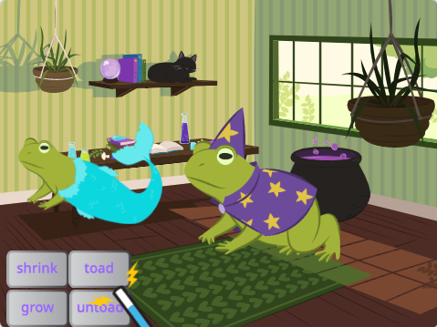
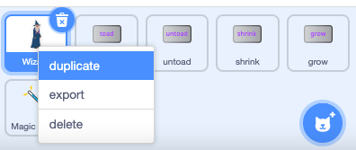

## Add another character

Get a sprite of your choice to respond to the spells. You will need to create a toad costume for the sprite and add code to change on the spell broadcast messages.

{:width="300px"}

--- task ---
Duplicate the **Wizard** sprite. 

Delete the 'Wizard-a' and 'Wizard-toad-a' costumes. You will be left with a 'toad' costume.

Add a costume of your choice to the **new sprite**. 

We chose the **Batter**:

You might want to change the direction the sprite is pointing in. 

**Tip:** If your sprite goes upside down you can change its `rotation-style`{:class="block3motion"} to `left-right` in the Sprite properties pane or using a code block.

--- /task ---

--- task ---

To keep the character's feet in the same place when they grow and shrink you will need to reposition the costume above the crosshair.

First use the **Select** (arrow) tool to draw a rectangle around the costume and then **Group** it. Then drag your character above the crosshair.

--- /task ---

--- task ---

Click on the 'toad' costume.

Rename the costume to match your sprite, we used 'Batter-toad-a'.

--- /task ---

--- task ---

If the toad costume is facing the opposite way to the main costume you can use 'Flip Horizontal'.

--- /task ---

Now you need to make the toad look like the character. This could be just a small detail like a splash of a colour or a shared accessory.

--- task ---

You can either:
+ Copy items from the sprite costume and paste them onto the toad costume, or
+ Add an accessory (such as a hat or sunglasses) as another costume and then copy and paste it to the character and toad costumes, or
+ Use the paint editor to add features to the toad to match the character.

**Tip:** You can group all the objects in a costume by selecting them (with the Select tool or <kbd>
Ctrl-a</kbd>) and then clicking 'Group'.

Our Batter toad looks like this:

--- /task ---

--- task ---
Switch to the **Code** tab for your new sprite.

Change all of the `switch costume`{:class="block3looks"} blocks to use the correct costumes for your new sprite.

You might also want to change the start `size`{:class="block3looks"} of the sprite `when green flag clicked`{:class="block3events"}.

--- /task ---

--- task ---
**Test:** Click on the spell buttons and both characters should respond to the spell broadcasts.

**Debug:** Check that you have changed the costumes in the `switch costume`{:class="block3looks"} blocks for your new sprite.

--- /task ---

--- save ---