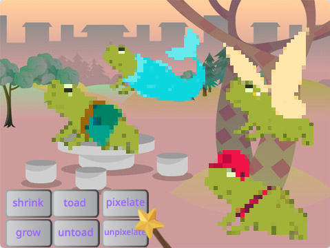

## Challenge

How will you expand your magical world?

--- task ---

Add more characters

--- /task ---  

--- task ---

Add different sound and visual effects to the wand.

--- /task ---

--- task ---

Add more spells — you could make characters disappear and reappear with `hide`{:class="block3looks"} and `show`{:class="block3looks"}, apply visual effects or turn them upside down.

--- /task ---

--- task ---

Create more spells with a friend and add them to your characters. 

Decide on which spells to create. 

Make sure you both use exactly the same name for the messages you broadcast.

--- /task ---

--- task ---

Swap characters with a friend! 

Swap project links to see each other's sprites. Save their sprites in your Scratch backpack or download the sprites to a shared area. 

Then go back to your project and add the saved sprites.

--- /task ---

[[[scratch-backpack]]]

--- collapse ---
---
title: Download a sprite
---

You can save sprites to your computer by downloading them from your project. Right-click on a sprite in the Sprite list and choose export.

To load a sprite into a project, choose the 'Upload a Sprite' option from the 'Choose a Sprite' menu.

--- /collapse ---

--- save ---
