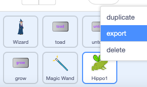

## Upgrade your project

How will you expand your magical world? You could:
+ Add more characters
+ Add more spells - you could make characters disappear and reappear with `hide`{:class="block3looks"} and `show`{:class="block3looks"}, apply graphic effects or turn them upside down.

Why not swap characters with a friend using the Scratch backpack or by downloading the sprite to a shared area. 

[[[scratch-backpack]]]

--- collapse ---

---
title: Download a sprite
---

You can save sprites to your computer by downloading them from your project. Right-click on a sprite in the Sprite list and choose export.

To load a sprite into a project, choose the 'Upload a Sprite' option from the 'Choose a Sprite' menu.

--- /collapse ---

You could agree more spells with a friend and both add them to your character. Make sure you both use exactly the same name for the messages you broadcast.

--- collapse ---

---
title: Completed project
---

You can view the [completed project here](https://scratch.mit.edu/projects/485673032/){:target="_blank"}.

--- /collapse ---

--- save ---