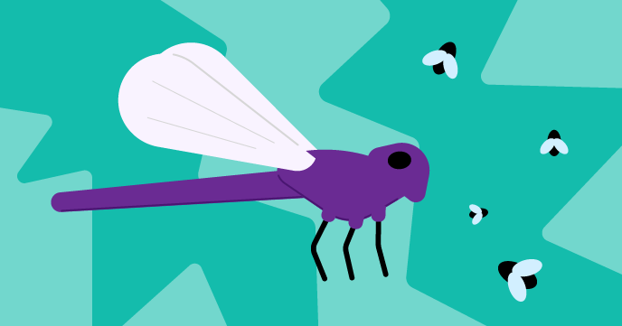

## What next?

If you are following the [More Scratch](https://projects.raspberrypi.org/en/raspberrypi/more-scratch) path, you can move on to the [Dragonfly](https://projects.raspberrypi.org/en/projects/dragonfly) project. In this project, you will make a Dragonfly that eats Mosquitos.

--- print-only ---

--- /print-only ---

--- no-print ---

  <iframe allowtransparency="true" width="485" height="402" src="https://scratch.mit.edu/projects/embed//?autostart=false" frameborder="0"></iframe>

--- /no-print ---

