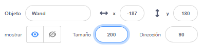
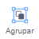

## Elige tu varita

<div style="display: flex; flex-wrap: wrap">
<div style="flex-basis: 200px; flex-grow: 1; margin-right: 15px;">
En este paso, prepararás la escena, elegirás tu varita y crearás tu propia magia generada por computadora.
  
</div>
<div>
{:width="300px"}
</div>
</div>

<p style="border-left: solid; border-width:10px; border-color: #0faeb0; background-color: aliceblue; padding: 10px;">
<span style="color: #0faeb0">**Imágenes generadas por computadora (CGI)**</span> pueden ser usadas para crear efectos especiales que no ocurren en el mundo real. Hacer una película o animación de fantasía moderna implica mucho código y arte computarizado.
</p>

--- task ---

Abre el [Proyecto de Iniciación emision de hechizos](https://scratch.mit.edu/projects/518441891/editor){:target="_blank"}. Scratch se abrirá en otra pestaña del navegador.

[[[working-offline]]]

--- /task ---

--- task ---

Deberías ver un hada en un bosque.


--- /task ---

Necesitas una varita para emitir un hechizo.

--- task ---

Haga clic en **Elija un Sprite** y escriba `varita mágica` en el cuadro de búsqueda:


**Elija:** Agregue la varita que prefiera para su proyecto.

--- /task ---

--- task ---

Agregue código para hacer que el sprite **Varita** siga el `puntero del mouse`{:class="block3motion"} y permanezca en `frente`{:class="block3looks"} de los botones:


```blocks3
when flag clicked
forever
go to (mouse-pointer v) //change from 'random position'     
go to [front v] layer // in front of the buttons
end
```

--- /task ---

--- task ---

**Prueba:** Haz clic en la bandera verde para ejecutar tu proyecto. La varita seguirá el puntero del mouse.

--- /task ---

Haz la varita más grande e inclinada, como si realmente la estuvieras usando.

--- task ---

Ve al panel del Duende y cambia la propiedad **Tamaño** a `200` para agrandar la varita:



--- /task ---

--- task ---

Haga clic en la pestaña **Disfraces** para abrir el disfraz de varita mágica en el editor de pintura.

Haga clic en la herramienta **Seleccionar** (Flecha) y luego dibuja un rectángulo alrededor de toda la varita para seleccionar todas las partes del disfraz.


Luego haz clic en el icono **Grupo** para combinar las partes de la varita.



--- /task ---

--- task ---

Usa la herramienta **Rotar** en la varita para colocar la varita en ángulo.


**Sugerencia:** Si no puedes ver la herramienta **Rotar** , haz clic en la herramienta **Alejar** (-) en la parte inferior del editor de Pintura para alejar.

--- /task ---

El disfraz **Varita** se interpone en el camino del cursor del mouse cuando intentas hacer clic en los botones.

--- task ---

Mueva la varita para que su punta quede alejada de la cruz en el centro.


--- /task ---

--- task ---

**Prueba:** Presiona la bandera verde y mueve el mouse al rededor del escenario. La varita deberia seguir al cursor.

--- /task ---

--- task ---

Si ha iniciado sesión en su cuenta de Scratch, haga clic en el botón verde Remix. Esto guardará una copia del proyecto en su cuenta de Scratch.


Puedes cambiar el titulo de tu proyecto.


**Sugerencia:** Asigne nombres útiles a sus proyectos para que pueda encontrarlos fácilmente cuando tenga muchos proyectos.

Si no tiene una cuenta de Scratch, puede hacer clic en **Archivo** y luego en **Guardar en su computadora** para guardar una copia del proyecto.

--- /task ---

--- save ---
