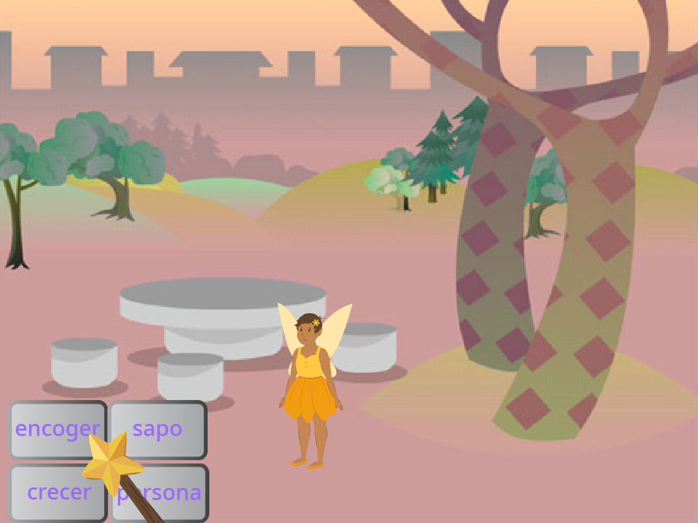
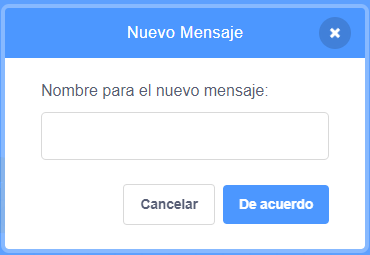
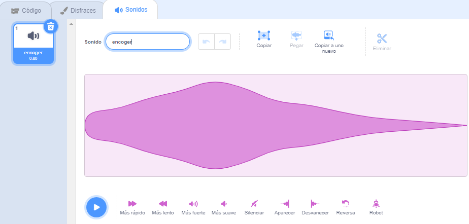

## El hechizo para encoger

<div style="display: flex; flex-wrap: wrap">
<div style="flex-basis: 200px; flex-grow: 1; margin-right: 15px;">
Ahora harás que el hada se encoja cuando hagas click en el botón de encoger.
</div>
<div>
{:width="300px"}
</div>
</div>

--- task ---

Haga clic en el sprite **encoger** en la lista de Sprites debajo del escenario.

Agrega un `cuando se haga click en este sprite`{:class="block3events"} bloque:


```blocks3
when this sprite clicked
```

--- /task ---

Cuando haces clic en el botón de encoger, quieres que el sprite **Hada** se encoja.

El sprite **encoger** necesita `transmitir`{:class="block3events"} un `mensaje`{:class="block3events"} para que el sprite **Encantado** sepa que se ha emitido el hechizo encogedor.

--- task ---

Agrega un bloque `broadcast`{:class="block3events"}:


```blocks3
when this sprite clicked
+ broadcast (message1 v)
```

--- /task ---

--- task ---

Haz click en `mensaje1`{:class="block3events"} y selecciona 'Nuevo mensaje'. Nombre el nuevo mensaje `encoger`.



Tu código debería parecerse a esto:


```blocks3
when this sprite clicked
broadcast (shrink v)
```

--- /task ---

Ahora, cuando haga clic en el botón **encoger** , Scratch `transmitirá`{:class="block3events"} el mensaje `encoger`{:class="block3events"}, pero no pasara nada aun.

--- task ---

Agregue código al sprite**Encantado** para que se reduzca cuando reciba un mensaje de `encoger`{:class="block3events"}:


```blocks3
when I receive [shrink v]
change size by [-10] // negative numbers decrease the size
```

--- /task ---

--- task ---

**Prueba:** Haz click en el botón **encoger** para reducir al sprite **Encantado**. Haz esto tantas veces como quieras.

**Depuración:** Si tu sprite **Encantado** crece en lugar de encogerse, agrega un menos `-` antes del número `10` para convertirlo en un número negativo `-10`.

--- /task ---

--- task ---

Agregue un guion para establecer al sprite **Encantado** a tamaño normal `cuando se hace click en la bandera verde`{:class="block3events"}:


```blocks3
when flag clicked
set size to [100] %
```

--- /task ---

Cuando los mensajes son `transmitidos`{:class="block3events"}, pueden ser recibidos por todos los sprites. Cuando la **Varita** `recibe`{:class="block3events"} el mensaje de `encogerse`{:class="block3events"} debe `reproducir un sonido`{:class="block3sound"}.

--- task ---

Haz click en la **Varita** del sprite y luego en la pestaña **Sonidos**.

Agregue el sonido **Silvido**.

Cambie el nombre del sonido a `encoger` para que sea fácil de encontrar.




--- /task ---

--- task ---

Agregue un guion para reproducir el sonido:


```blocks3
when I receive [shrink v]
play sound [shrink v] until done

```

--- /task ---

--- task ---

**Prueba:** Haz click en la bandera verde para ejecutar tu proyecto. Haz click en el botón **encoger** para escuchar el sonido y ver como se encoge el **Hada**.

--- /task ---

El boton **encoger** `transmite`{:class="block3events"} un mensaje `encoger`{:clase="block3events"}. Tanto el **Hada** como la **Varita** `recibieron`{:class="block3events"} el mensaje y respondieron.

--- save ---
