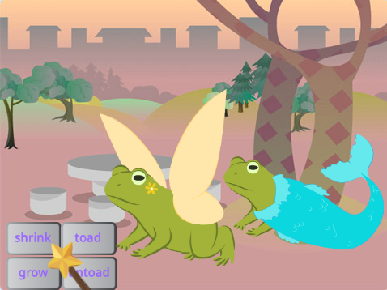

## Agregar otro personaje

Consigue un sprite de tu elección para responder a los hechizos. Necesitarás crear una 'combinación' de disfraz de sapo para el sprite y agregar código para que el disfraz cambie cuando se transmitan los mensajes de hechizo.

{:width="300px"}

--- task ---

Duplica el sprite **Hada**.

Elimina los disfraces **Fairy-a** y **Fairy-toad-a**. Te quedarás con un disfraz de **sapo**.

Agrega un disfraz de tu elección al **nuevo sprite**.

Elegimos el **bateador**:

Es posible que desee cambiar la dirección hacia la que apunta el sprite.

**Sugerencia:** Si tu sprite se pone al revés, puedes cambiar su `estilo de rotación`{:class="block3motion"} a `de izquierda a derecha`{:class="block3motion"} en el panel de propiedades de Sprite o usando código.

--- /task ---

Cuando creces o encoges un sprite, quieres que los pies permanezcan en el mismo lugar.

--- task ---

Primero use la herramienta **Seleccionar** (flecha) para dibujar un rectángulo alrededor del disfraz y luego **Agrupar**. Luego arrastra a tu personaje por encima de la cruz.

--- /task ---

--- task ---

Haz clic en el disfraz **sapo**.

Cambia el nombre del disfraz para que coincida con tu sprite, usamos **Batter-toad-a**.

--- /task ---

--- task ---

Si el disfraz de sapo está orientado en dirección opuesta al disfraz principal, puedes usar **Giro Horizontal**.

--- /task ---

Ahora necesitas hacer que el sapo se parezca al personaje. La combinación de dos disfraces de esta manera se llama 'mash-up'.

--- task ---

Puede agregar un pequeño detalle, como un toque de color, o copiar y pegar gafas de sol o un sombrero en el editor de pinturas.

**Consejo:** Puedes agregar cualquier disfraz a tu objeto de personaje. Use la herramienta **Seleccionar** (flecha) y luego haga clic en **Copiar** o **Pegar**.

**Consejo:** Puedes agrupar todos los objetos en un disfraz. Selecciónelos (con la herramienta **Seleccionar** o <kbd> Ctrl-a</kbd>) y luego haga clic en **Grupo**.

Nuestro sapo bateador se parece a: 

--- /task ---

--- task ---

Cambia a la pestaña **Código** para tu nuevo sprite.

Cambia todos los bloques `cambiar disfraz`{:class="block3looks"} para usar los disfraces correctos para tu nuevo sprite.

También es posible que desee cambiar el `tamaño inicial `{:class="block3looks"} del sprite `cuando se hizo clic en la bandera verde`{:class="block3events"}.

--- /task ---

--- task ---

**Prueba:** Haga clic en los botones de hechizo: ambos personajes deben responder a los hechizos transmitidos.

**Depuración:** Comprueba que hayas cambiado los disfraces en los bloques `cambia el disfraz`{:class="block3looks"} para tu nuevo sprite.

--- /task ---

--- save ---
