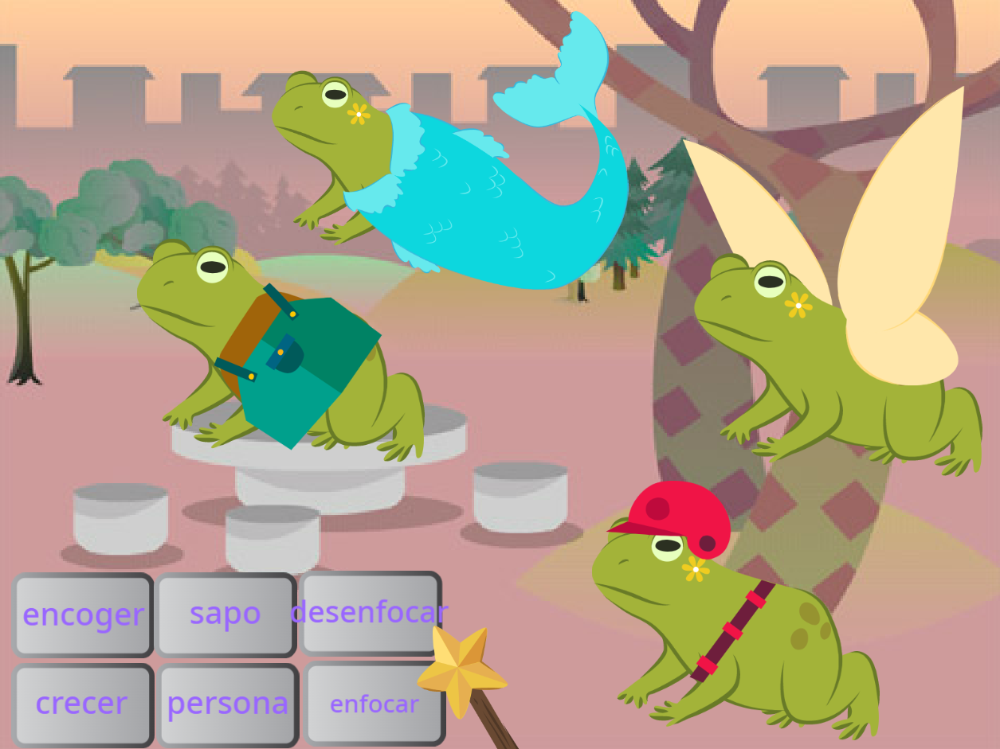
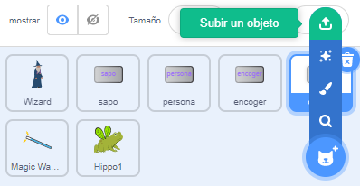

## Mejora tu proyecto

¿Cómo expandirás tu mundo mágico? Tú podrías:
+ Añadir más personajes
+ Agrega diferentes efectos visuales y de sonido a la varita.
+ Agregue más hechizos: puede hacer que los personajes desaparezcan y reaparezcan con `ocultar`{:class="block3looks"} y `mostrar`{:class="block3looks"}, aplicar efectos visuales o darles la vuelta.

¿Por qué no intercambiar personajes con un amigo? Primero, intercambie los enlaces de los proyectos con un amigo para ver los sprites de los demás. Para guardar sus sprites, use su Scratch backpack o descargue los sprites en un área compartida. Luego regresa a tu proyecto y agrega los sprites guardados.

[[[scratch-backpack]]]

--- collapse ---
---
title: Descargar un sprite
---

Puede guardar sprites en su computadora descargándolos de su proyecto. Haga clic derecho en un sprite en la lista de Sprite y seleccione export.

Para cargar un sprite en un proyecto, elija la opción ''Upload a Sprite' en el menú 'Choose a Sprite'.

--- /collapse ---

Crea más hechizos con un amigo y añádelos a tus personajes. Decide qué hechizos crear. Asegúrese de que ambos usen exactamente el mismo nombre para los mensajes que transmiten.

--- collapse ---
---
title: Proyecto terminado
---

Puedes ver el [proyecto terminado aquí](https://scratch.mit.edu/projects/518413238/){:target ="_blank"}.

--- /collapse ---

--- save ---
