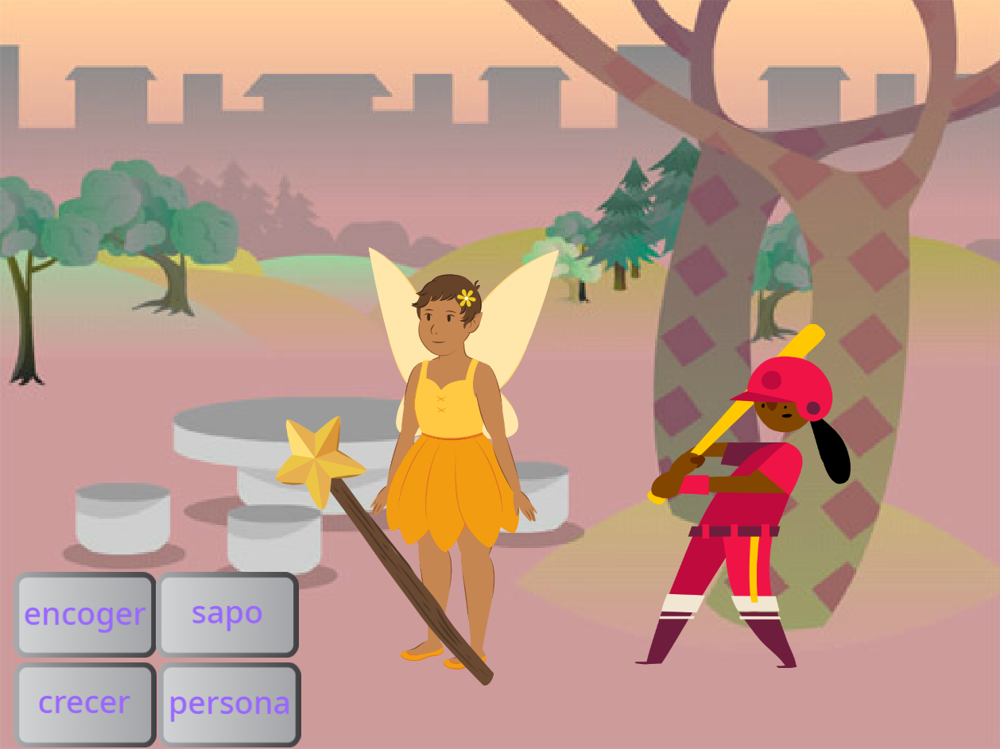

## Esto es lo que haras

Crea una aplicación en la que usaras una varita mágica para convertir a los duendes en sapos, luego hazlos crecer y encogelos.

Tienes que:
+ Crear botones que `transmitan`{:class="block3events"} mensajes a otros sprites
+ Lograr que varios sprites respondan cuando ellos `reciban`{:class="block3events"} el mismo mensaje
+ Usa el menu `Sonidos`{:class="block3sound"} para invertir sonidos

**Transmitir** y **Recibir** mensajes es como un patrón de **llamada y respuesta** en la música.
 
 
  "P3T3 P3T3 es una canción tradicional de Ghana, África Occidental. Lo realiza un líder que **llama** a un grupo que **responde** repitiendo una frase clave cuando escuchan el llamado" - Kwame Bakoji-Hume, Actividades africanas CIC

<audio controls><source src="images/Pete-Pete.mp3" type="audio/wav"></audio>  

--- no-print ---

### Reproducir ▶️

--- task ---

  
Usa la varita mágica para hacer clic en los botones y emitir hechizos. ¿Qué les hace cada hechizo a los personajes?

  <iframe allowtransparency="true" width="485" height="402" src="https://scratch.mit.edu/projects/embed/518413238/?autostart=false" frameborder="0"></iframe>

--- /task ---
--- /no-print ---

--- print-only ---

--- /print-only ---

