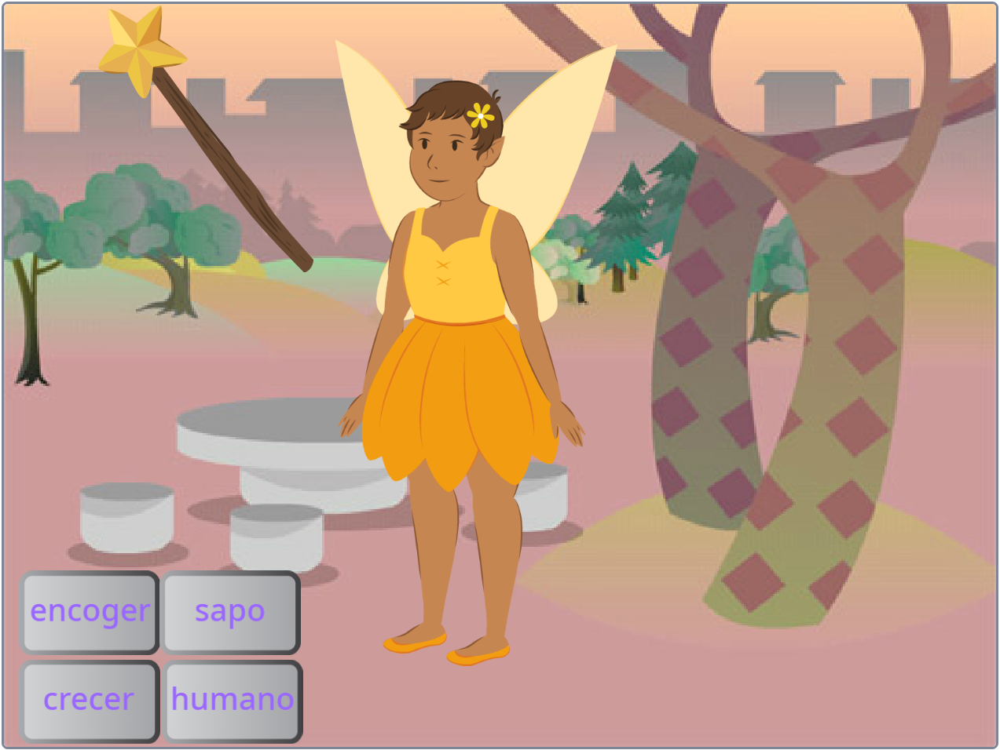
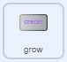
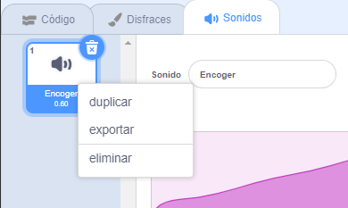
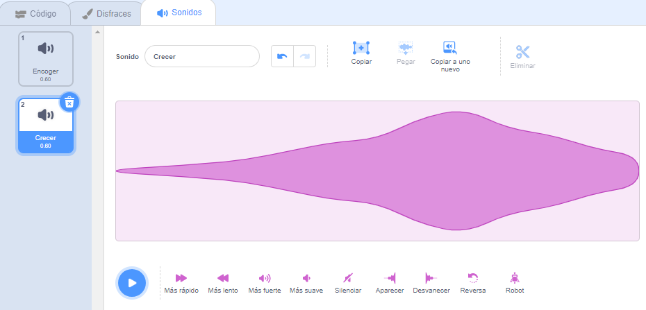

## El hechizo de crecimiento

<div style="display: flex; flex-wrap: wrap">
<div style="flex-basis: 200px; flex-grow: 1; margin-right: 15px;">
¡También necesitas un hechizo de crecimiento para devolver el sprite **Hada** a su tamaño normal o para hacer un hada enorme!
</div>
<div>
{:width="300px"}
</div>
</div>

**Sugerencia:** En este paso, agregará código a tres sprites diferentes. Asegúrese de seleccionar el sprite correcto de la lista de Sprite debajo del escenario y haga clic en la pestaña **Código**.

--- task ---

Agregue un script al sprite del botón **crecer** para `transmitir`{:class="block3events"} un mensaje `crecer`{:class="block3events"}:



```blocks3
when this sprite clicked
broadcast (crecer v)
```

--- /task ---

--- task ---

Agrega un script para hacer crecer el sprite **Fairy**:


```blocks3
when I receive [crecer v]
change size by [10] // los números positivos aumentan el tamaño
```

--- /task ---

¡Puede invertir el sonido de 'reducir' para hacer un sonido de 'crecer'!

<p style="border-left: solid; border-width:10px; border-color: #0faeb0; background-color: aliceblue; padding: 10px;">
<span style="color: #0faeb0">**Cuestionarios de canciones tocadas al revés**</span> son cuestionarios de música con un giro. Las pistas están invertidas y los concursantes tienen que adivinar la canción original; no es tan fácil como parece. 
</p>

--- task ---

Haz click en el sprite de la **Varita** y luego en la pestaña **Sonidos**.

Haga clic con el botón derecho (o toque y mantenga presionado) el sonido **reducir** y elija **duplicar**.




Nombra la copia `crecer`.

Haga clic en el icono **Invertir** para que el sonido se reproduzca al revés.



--- /task ---

--- task ---

Agregue un script al sprite **Varita** para reproducir el sonido `crecer`{:class="block3sound"} cuando se recibe el mensaje `crecer`{:class="block3events"}:


```blocks3
when I receive [crecer v]
play sound [crecer v] until done
```

--- /task ---

--- task ---

**Prueba:** Haz clic en los botones de hechizo **reducir** y **crecer** para lanzar los hechizos tantas veces como quieras.

--- /task ---

--- save ---

