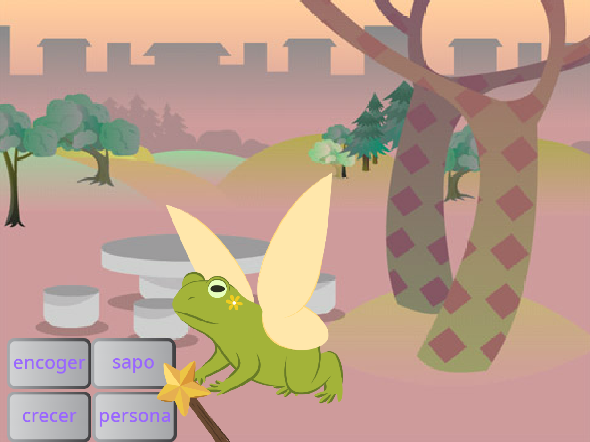
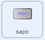
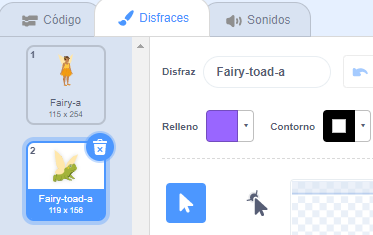
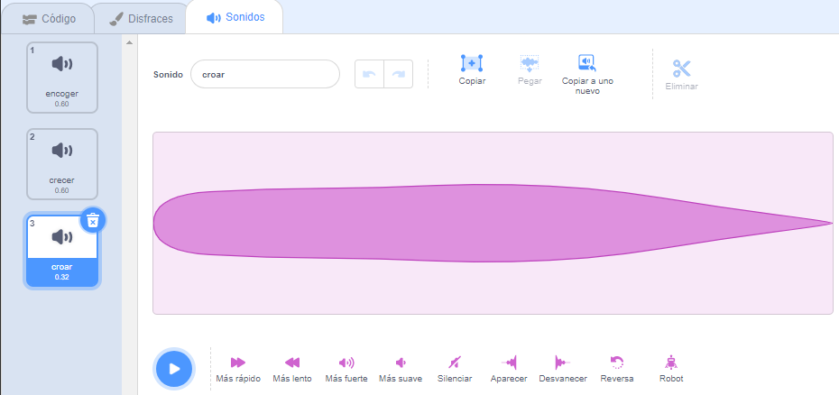
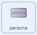
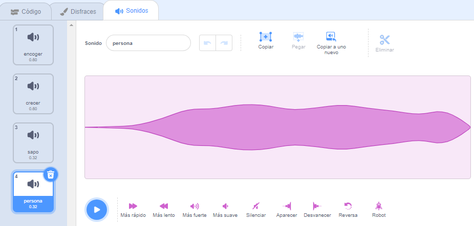

## Transformación a sapo

<div style="display: flex; flex-wrap: wrap">
<div style="flex-basis: 200px; flex-grow: 1; margin-right: 15px;">
Ahora es el momento para otro hechizo. ¡Esta vez vas a lanzar un hechizo de transformación transmitiendo un mensaje `sapo`{:class="block3events"} que convierte al sprite **Hada** en un sapo! 

Tal vez se vaya a una aventura en la que será más útil ser un sapo.
</div>
<div>
{:width="300px"}
</div>
</div>

--- task ---

Agregue una secuencia de comandos al sprite del botón **sapo** para transmitir el mensaje 'sapo':



```blocks3 
when this sprite clicked
broadcast [sapo v]
```

--- /task ---

--- task ---

Seleccione el sprite **Hada** y haga clic en la pestaña **Disfraces**.

Para transformar el sprite **Hada** en un sapo, usará disfraces **Hada-a** y **Hada-sapo-a**.



--- /task ---

--- task ---

Haga clic en la pestaña **Código** y agregue un `cambio de disfraz a`{:class="block3looks"} bloque al final del existente`cuando se hace click en la bandera`secuencias de comandos{:class="block3events"} para que el Hada esté en la forma humana cuando ejecuta su proyecto:


```blocks3
when flag clicked
set size to [100] %
+ switch costume to [Fairy-a v]
```

--- /task ---

--- task ---

Agregue un nuevo script al sprite **Hada** para convertirse en un sapo:


```blocks3  
when I receive [sapo v]
switch costume to [Fairy-toad-a v]
```

--- /task ---

--- task ---

Agrega el sonido **Croar** al sprite **Varita**.

Cambie el nombre del sonido a `sapo`:




--- /task ---

--- task ---

Agregue un script al sprite **Varita** para reproducir el sonido `sapo`{:class="block3sound"} cuando se lanza el hechizo sapo:


```blocks3  
when I receive [sapo v]
play sound [sapo v] until done
```

--- /task ---

--- task ---

**Prueba:** Prueba que puedes convertir el **Hada** en un sapo, con un efecto de sonido, cuando haces clic en el botón **sapo**. Haga clic en la bandera verde nuevamente para convertir el sprite **Hada** nuevamente en un humano.


--- /task ---

Lo opuesto a un hechizo de 'sapo' es un hechizo de 'persona'.

--- task ---

Agregue una secuencia de comandos al sprite de botón **persona** para `transmitir`{:class="block3events"} el mensaje 'persona'{:class="block3events"}:



```blocks3 
when this sprite clicked
broadcast [convertir en persona v]
```

--- /task ---

--- task ---

Agrega un nuevo script a `persona`{:class="block3events"} el sprite **Hada**:


```blocks3  
when I receive [convertir en persona v]
switch costume to [Fairy-a v]
```

--- /task ---

--- task ---

Seleccione el sprite **Varita** y cambie a la pestaña **Sonidos**.

**Duplicar** el sonido **sapo** y cambiarle el nombre a `persona`.

Haga clic en el icono **Reversa** para que el sonido **persona** se reproduzca al revés.




--- /task ---

--- task ---

Agregue un script al sprite **Varita** para reproducir el sonido `persona`{:class="block3sound"}:


```blocks3  
when I receive [convertir en persona v]
play sound [convertir en persona v] until done
```

--- /task ---

--- task ---

**Prueba:** Pruebe los hechizos **sapo** y **persona**, y pruebe **encoger** y **crecer** cuando el **Hada** esté en forma de sapo.

--- /task ---

--- save ---
