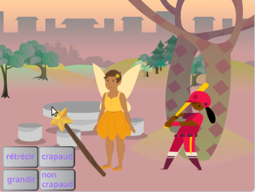

## Introduction

Crée une application dans laquelle tu vas utiliser une baguette magique pour transformer les sprites en crapauds. Ensuite, fais les grandir et fais les rétrécir.

Tu vas devoir :
+ Créer des boutons qui `envoient à tous`{:class="block3events"} des messages à d'autres sprites
+ Obliger plusieurs sprites à répondre lorsqu'ils `reçoivent`{:class="block3events"} le même message
+ Utiliser le menu des blocs `Son`{:class="block3sound"} pour inverser les sons

**La diffusion** et **la réception** de messages sont comme un modèle d'appel et de réponse dans la musique.
 
 
  "P3T3 P3T3 est une chanson traditionnelle du Ghana, en Afrique de l'Ouest. Elle est réalisée par une personne principale qui appelle et un groupe qui répond en répétant une phrase clé lorsqu'il entend l'appel." - Kwame Bakoji-Hume, African Activities CIC

<audio controls><source src="images/Pete-Pete.mp3" type="audio/wav"></audio>  

--- no-print ---
--- task ---

### Essaie-le

  
Utilise la baguette magique pour cliquer sur les boutons et lance des sorts. Que fait chaque sort aux personnages ?

  <iframe allowtransparency="true" width="485" height="402" src="https://scratch.mit.edu/projects/embed/657519720/?autostart=false" frameborder="0"></iframe>

--- /task ---
--- /no-print ---

--- print-only ---

--- /print-only ---
