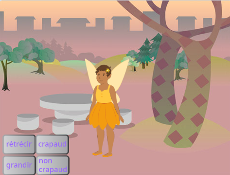

## Choisir ta baguette

<div style="display: flex; flex-wrap: wrap">
<div style="flex-basis: 200px; flex-grow: 1; margin-right: 15px;">
Pendant cette étape, tu vas créer le décor. Choisis ta baguette magique et crée ta propre magie générée par ordinateur.
  
</div>
<div>
{:width="300px"}
</div>
</div>

<p style="border-left: solid; border-width:10px; border-color: #0faeb0; background-color: aliceblue; padding: 10px;">
<span style="color: #0faeb0">**L'imagerie générée par ordinateur (CGI)**</span> peut être utilisée pour créer des effets spéciaux qui ne se produisent pas dans le monde réel. Créer un film ou une animation fantastique moderne implique beaucoup de codage et d'infographie.
</p>

--- task ---

Ouvre le [projet de démarrage Lancer des sorts](https://scratch.mit.edu/projects/660082237/editor){:target="_blank"}. Scratch s'ouvrira dans un autre onglet du navigateur.

[[[working-offline]]]

--- /task ---

--- task ---

Tu devrais voir une fée dans une forêt.



--- /task ---

Tu as besoin d'une baguette magique pour jeter un sort.

--- task ---

Clique sur **Choisir un sprite** et tape `wand` dans le champ de recherche :


**Choisir :** Ajoute la baguette magique de ton choix à ton projet.

--- /task ---

--- task ---

Ajoute du codage pour que le sprite **Baguette magique** suive le `pointeur de la souris`{:class="block3motion"} et reste `devant`{:class="block3looks"} les boutons :


```blocks3
when flag clicked
forever
go to (mouse-pointer v) //changer de "position aléatoire"     
go to [front v] layer // devant les boutons
end
```

--- /task ---

--- task ---

**Test :** Clique sur le drapeau vert pour tester ton projet. La baguette magique suivra le pointeur de ta souris.

--- /task ---

Rends la baguette magique plus grande et penchée, comme si tu l'utilisais vraiment.

--- task ---

Va dans le volet sprite et change la propriété **Taille** en `200` pour agrandir la baguette magique :


--- /task ---

--- task ---

Clique sur l'onglet **Costumes** pour ouvrir le costume de la baguette magique dans l'éditeur de peinture.

Clique sur l'outil **Sélectionner** (Flèche), puis dessine un rectangle entièrement autour de la baguette magique pour sélectionner toutes les parties du costume.


Ensuite clique sur l'icône **Grouper** pour combiner les différentes parties de la baguette magique.


--- /task ---

--- task ---

Utilise l'outil **Rotation** sur la baguette magique pour positionner la baguette magique en oblique.


**Astuce :** Si tu ne vois pas l'outil **Rotation**, clique sur l'outil **Zoom arrière** (-) en bas de l'éditeur de peinture pour effectuer un zoom arrière.

--- /task ---

Le costume **Baguette magique** gêne le curseur de la souris lorsque tu essaies de cliquer sur les boutons.

--- task ---

Déplace la baguette magique de manière à ce que son extrémité soit à l'écart du réticule qui se trouve au centre.


--- /task ---

--- task ---

**Test :** Clique sur le drapeau vert et déplace la souris sur la scène. La baguette magique devrait suivre.

--- /task ---

--- task ---

Si tu es connecté à ton compte Scratch, clique sur le bouton vert Remix. Cela enregistrera une copie du projet sur ton compte Scratch.


Tu peux modifier le titre de ton projet.


**Astuce :** Donne à tes projets des noms utiles afin de pouvoir les retrouver facilement lorsque tu auras de nombreux projets.

Si tu n'as pas de compte Scratch, tu peux cliquer sur **Fichier** puis **Enregistrer sur votre ordinateur** pour enregistrer une copie de ton projet.

--- /task ---

--- save ---
