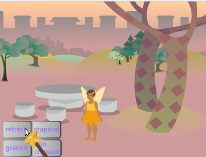
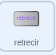
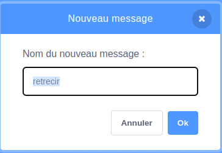
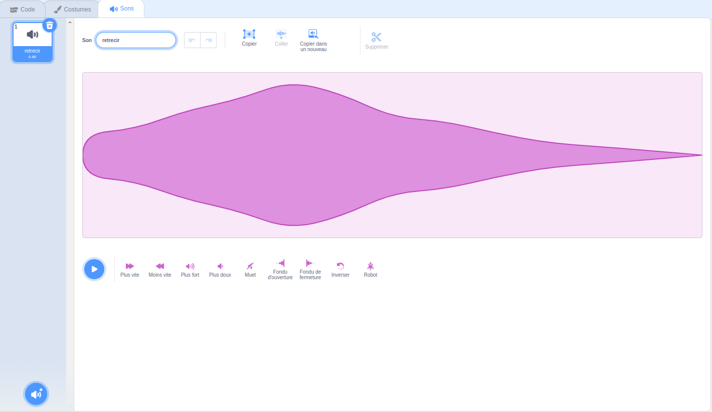

## Le sort "rétrecir"

<div style="display: flex; flex-wrap: wrap">
<div style="flex-basis: 200px; flex-grow: 1; margin-right: 15px;">
Maintenant, tu vas pouvoir faire rétrecir la fée lorsque tu cliqueras sur le bouton rétrécir.
</div>
<div>
{:width="300px"}
</div>
</div>

--- task ---

Clique sur le sprite **rétrécir** dans la liste des sprites qui se trouve en dessous de la scène.

Ajoute un bloc `quand ce sprite est cliqué`{:class="block3events"} :



```blocks3
when this sprite clicked
```

--- /task ---

Quand tu cliques sur le bouton rétrécir, le sprite **Fée** doit rétrécir.

Le **rétrécissement** du sprite doit `envoyer à tous`{:class="block3events"} un `message`{:class="block3events"} pour que le sprite **Fée** sache que le sort rétrécir a été lancé.

--- task ---

Ajoute un bloc `envoyer à tous`{:class="block3events"} :


```blocks3
when this sprite clicked
+ broadcast (message1 v)
```

--- /task ---

--- task ---

Clique sur `message1`{:class="block3events"} et choisis "Nouveau message". Nomme le nouveau message `rétrécir`.



Ton code devrait ressembler à ceci :


```blocks3
when this sprite clicked
broadcast (rétrécir v)
```

--- /task ---

Maintenant, quand tu cliques sur le bouton **rétrécir** , Scratch `enverra à tous`{:class="block3events"} le message `rétrécir`{:class="block3events"}, mais rien ne se passera encore.

--- task ---

Ajoute du code au sprite **Fée** pour le réduire lorsqu'il reçoit un message `rétrécir`{:class="block3events"} :


```blocks3
when I receive [rétrécir v]
change size by [-10] // les nombres négatifs diminuent la taille
```

--- /task ---

--- task ---

**Test :** Clique sur le bouton **rétrécir** pour rétrécir le sprite **Fée**. Fais cela autant de fois que tu le souhaites.

**Débogage :** Si ton sprite **Fée** grandit au lieu de rétrécir, ajoute un moins `-` avant le nombre `10` pour faire un nombre négatif `-10`.

--- /task ---

--- task ---

Ajoute un script pour définir le sprite **Fée** à la taille normale `quand le drapeau vert`{:class="block3events"} est cliqué :


```blocks3
when flag clicked
set size to [100] %
```

--- /task ---

Lorsque les messages sont `envoyés à tous`{:class="block3events"} ils peuvent être reçus par tous les sprites. Lorsque la **Baguette magique** `reçoit`{:class="block3events"} le message `rétrécir`{:class="block3events"}, elle doit `jouer un son`{:class="block3sound"}.

--- task ---

Clique sur le sprite **Baguette magique** et ensuite sur l'onglet **Sons**.

Ajoute le son **Slide Whistle**.

Renomme le son en `rétrécir` pour qu'il soit facile à trouver.




--- /task ---

--- task ---

Ajoute un script pour jouer le son :


```blocks3
when I receive [rétrécir v]
play sound [rétrécir v] until done

```

--- /task ---

--- task ---

**Test :** Clique sur le drapeau vert pour tester ton projet. Clique sur le bouton **rétrécir** pour entendre le son et voir la **Fée** rétrécir.

--- /task ---

Le bouton **rétrécir** `envoie à tous`{:class="block3events"} un message `rétrécir`{:class="block3events"}. Le sprite **Fée** et **Baguette magique** `ont tous les deux reçus`{:class="block3events"} le message et ils ont répondu.

--- save ---
