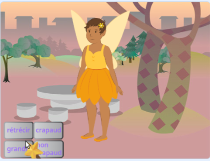
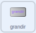
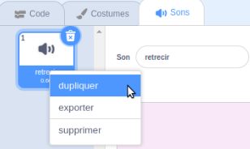
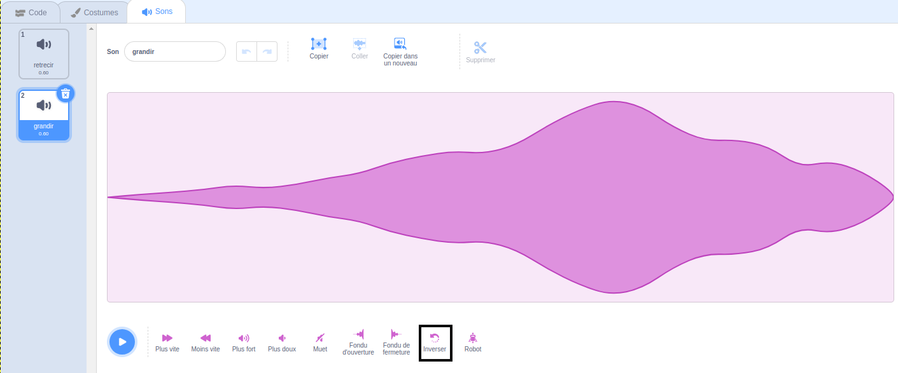

## Le sort "grandir"

<div style="display: flex; flex-wrap: wrap">
<div style="flex-basis: 200px; flex-grow: 1; margin-right: 15px;">
Tu as également besoin d'un sort d'agrandissement pour ramener le sprite **Fée** à sa taille normale ou pour créer une énorme fée !
</div>
<div>
{:width="300px"}
</div>
</div>

**Astuce :** Dans cette étape, tu vas ajouter du code à trois sprites différents. Assure-toi de sélectionner le bon sprite dans la liste Sprite sous la scène et clique sur l'onglet **Code**.

--- task ---

Ajoute un script au sprite bouton **grandir** pour `envoyer à tous`{:class="block3events"} un message `grandir`{:class="block3events"}  :



```blocks3
when this sprite clicked
broadcast (grow v)
```

--- /task ---

--- task ---

Ajoute un script pour faire grandir le sprite **Fée** :


```blocks3
when I receive [grow v]
change size by [10] // positive numbers increase the size
```

--- /task ---

Tu peux inverser le son « rétrécir » pour faire un son « grandir » !

<p style="border-left: solid; border-width:10px; border-color: #0faeb0; background-color: aliceblue; padding: 10px;">
<span style="color: #0faeb0">**Chansons jouées à l'envers des quiz**</span> sont des quiz musicaux avec une touche. Les pistes sont inversées et les candidats doivent deviner la chanson originale - ce n'est pas aussi facile qu'il y paraît. 
</p>

--- task ---

Sélectionne le sprite **Baguette magique** et clique sur l'onglet **Son**.

Fais un clic droit (ou appuie et maintiens) le son **reduire** et choisis **dupliquer**.




Nomme la copie `grandir`.

Clique sur l'icone **Inverser** pour faire jouer le son à l'envers.



--- /task ---

--- task ---

Ajoute un script au sprite **Baguette magique** pour jouer le son `grandir`{:class="block3sound"} lorsque le message `grandir`{:class="block3events"} est reçu :


```blocks3
when I receive [grow v]
play sound [grow v] until done
```

--- /task ---

--- task ---

**Test :** Clique sur les boutons de sorts **rétrécir** et **grandir** pour lancer les sorts autant de fois que tu le souhaites.

--- /task ---

--- save ---

