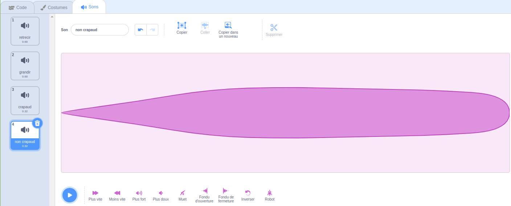

## Transformation de crapaud

<div style="display: flex; flex-wrap: wrap">
<div style="flex-basis: 200px; flex-grow: 1; margin-right: 15px;">
Il est temps maintenant pour un autre sortilège. Cette fois, tu vas lancer un sort de transformation en diffusant un message "crapaud"{:class="block3events"} qui transforme le sprite **Fée** en crapaud ! 

Peut-être qu'elle part à l'aventure où être un crapaud sera plus utile.
</div>
<div>
{:width="300px"}
</div>
</div>

--- task ---

Ajoute un script au sprite bouton **crapaud** pour envoyer à tous le message "crapaud" :


```blocks3 
when this sprite clicked
broadcast [toad v]
```

--- /task ---

--- task ---

Sélectionne le sprite **Fée** et clique sur l'onglet **Costumes**.

Pour transformer le sprite **Fée** en crapaud, tu utiliseras les costumes **fée-a** et **fée-crapaud-a**.


--- /task ---

--- task ---

Clique sur l'onglet **Code** et ajoute un bloc `basculer sur le costume`{:class="block3looks"} à la fin de ton script `quand le drapeau vert est cliqué`{:class="block3events"} pour que la fée soit de forme humaine lorsque tu exécutes ton projet :


```blocks3
when flag clicked
set size to [100] %
+ switch costume to [Fairy-a v]
```

--- /task ---

--- task ---

Ajoute un nouveau script au sprite **Fée** pour le transformer en crapaud :


```blocks3  
when I receive [toad v]
switch costume to [Fairy-toad-a v]
```

--- /task ---

--- task ---

Ajoute le son **Croak** au sprite **Baguette magique**.

Renomme le son en `crapaud`:


--- /task ---

--- task ---

Ajoute un script au sprite **Baguette magique** pour jouer le son `crapaud`{:class="block3sound"} lorsque le sort crapaud est lancé :


```blocks3  
when I receive [toad v]
play sound [toad v] until done
```

--- /task ---

--- task ---

**Test :** Teste que tu peux transformer la **Fée** en crapaud, avec un effet sonore, lorsque tu cliques sur le bouton **crapaud**. Clique à nouveau sur le drapeau vert pour transformer le sprite **Fée** en humain.


--- /task ---

Le contraire d'un sort « crapaud » est un sort « non-crapaud ».

--- task ---

Ajoute un script au sprite du bouton **non crapaud** pour `envoyer à tous`{:class="block3events"} le message "non crapaud"{:class="block3events"} :


```blocks3 
when this sprite clicked
broadcast [untoad v]
```

--- /task ---

--- task ---

Ajoute un nouveau script au sprite `non crapaud`{:class="block3events"} le sprite **Fée** :


```blocks3  
when I receive [untoad v]
switch costume to [Fairy-a v]
```

--- /task ---

--- task ---

Sélectionne le sprite **baguette magique** et passe à l'onglet **Sons**.

**Duplique** le son **crapaud** et le renomme en `non crapaud`.

Clique sur l'icône **Inverser** pour que le son **non crapaud** soit lu à l'envers.




--- /task ---

--- task ---

Ajoute un script au sprite **baguette magique** pour jouer le son `non crapaud`{:class="block3sound"} :


```blocks3  
when I receive [untoad v]
play sound [untoad v] until done
```

--- /task ---

--- task ---

**Test:** Essaie les sorts **crapaud** et **non crapaud**, et essaie **rétrécir** et **grandir** lorsque la **Fée** est sous forme de crapaud.

--- /task ---

--- save ---
