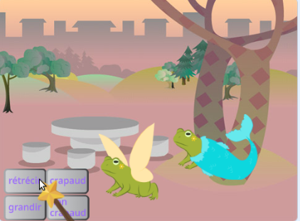
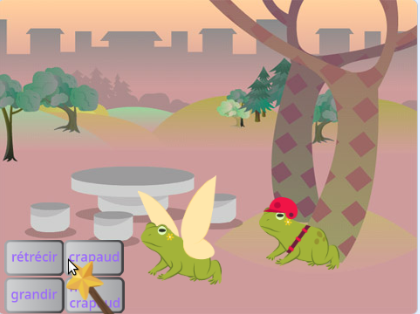
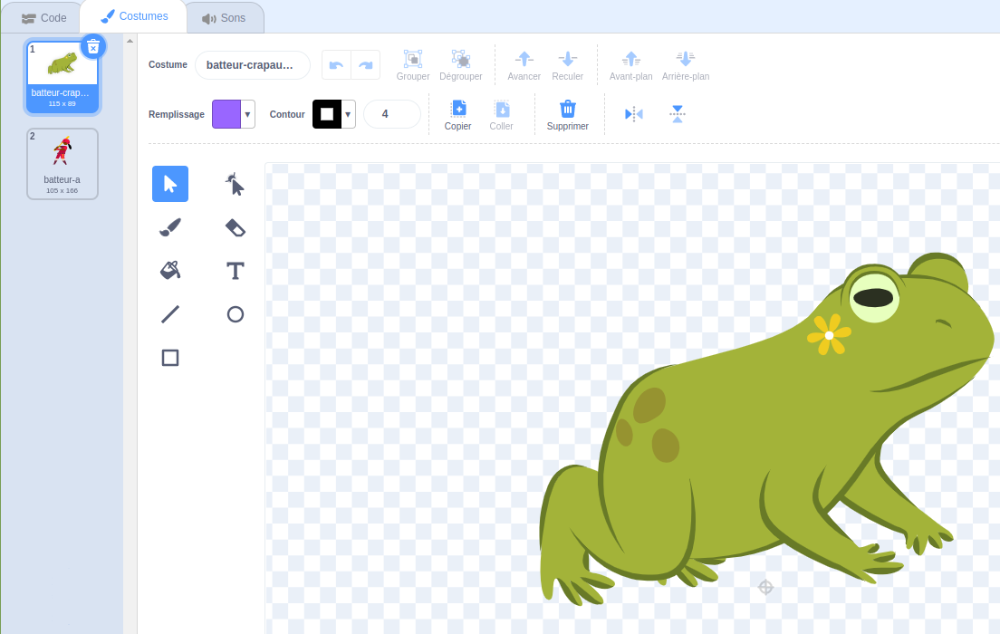
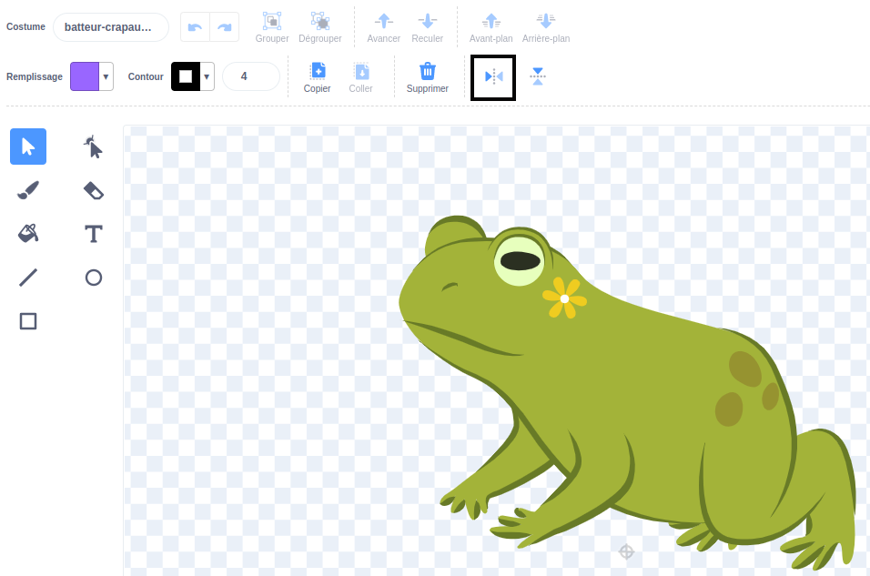

## Ajouter un autre personnage

Prends un sprite de ton choix pour répondre aux sorts. Tu devras créer un « mash-up » de costume de crapaud pour le sprite et ajouter du code pour que le costume change lorsque les messages de sorts sont diffusés.

{:width="300px"}

--- task ---

Duplique le sprite **Fée**.

Supprime les costumes **Fée-a** et **Fée-crapaud-a**. Tu te retrouveras avec un costume **crapaud**.

Ajoute un costume de ton choix au **nouveau sprite**.

Nous avons choisi **Batter** :

Tu voudras peut-être changer la direction dans laquelle le sprite pointe.

**Astuce :** Si ton sprite est à l'envers, tu peux modifier son `fixer le sens de rotation`{:class="block3motion"} en `gauche-droite`{:class="block3motion"} dans le volet des propriétés du sprite ou à l'aide d'un bloc code.

--- /task ---

Lorsque tu agrandis ou rétrécis un sprite, il faut que les pieds restent au même endroit.

--- task ---

Utilise d'abord l'outil **Sélectionner** (flèche) pour dessiner un rectangle autour du costume, puis le **Grouper**. Fais ensuite glisser ton personnage au-dessus du réticule.

--- /task ---

--- task ---

Clique sur le costume **crapaud**.

Renomme le costume pour qu'il corresponde à ton sprite, nous avons utilisé **batteur-crapaud-a**.

--- /task ---

--- task ---

Si le costume de crapaud fait face à l'opposé du costume principal, tu peux utiliser **Retourner horizontalement**.

--- /task ---

Maintenant, tu dois faire en sorte que le crapaud ressemble au personnage. Combiner deux costumes de cette manière s'appelle un « mash-up ».

--- task ---

Tu peux ajouter un petit détail, comme une touche de couleur, ou copier et coller des lunettes de soleil ou un chapeau dans l'éditeur de peinture.

**Astuce :** Tu peux ajouter n'importe quel costume au sprite de ton personnage. Utilise l'outil **Sélectionner** (flèche) puis clique sur **Copier** ou **Coller**.

**Astuce :** Tu peux grouper tous les objets dans un costume. Sélectionne-les (avec l'outil **Sélectionner** ou <kbd> Ctrl-a</kbd>) puis clique sur **Grouper**.

Notre crapaud batteur ressemble à : 

--- /task ---

--- task ---

Passe à l'onglet **Code** pour ton nouveau sprite.

Change tous les blocs `basculer sur le costume`{:class="block3looks"} pour utiliser les bons costumes pour ton nouveau sprite.

Tu peux également modifier la `taille`{:class="block3looks"} de début du sprite `quand le drapeau vert est cliqué`{:class="block3events"}.

--- /task ---

--- task ---

**Test :** Clique sur les boutons de sorts — les deux personnages doivent répondre aux sorts diffusés.

**Débogage :** Vérifie que tu as changé les costumes dans les blocs `basculer sur le costume`{:class="block3looks"} pour ton nouveau sprite.

--- /task ---

--- save ---
