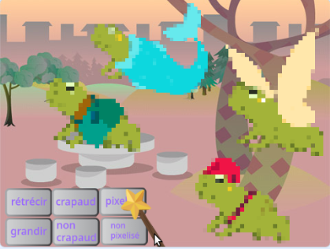
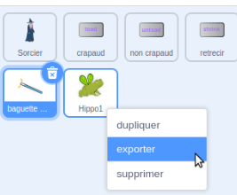

## Améliorer ton projet

Comment vas-tu étendre ton monde magique ? Tu pourrais :
+ Ajouter plus de personnages
+ Ajouter différents effets sonores et visuels à la baguette.
+ Ajouter plus de sorts — tu peux faire disparaître et réapparaître des personnages avec `cacher`{:class="block3looks"} et `montrer`{:class="block3looks"}, appliquer des effets visuels ou les retourner.

Pourquoi ne pas échanger de personnages avec un ami ? Tout d'abord, échange les liens du projet avec un ami pour voir les sprites de l'autre. Pour enregistrer leurs sprites, utilise ton sac à dos Scratch ou télécharge les sprites dans une zone partagée. Reviens ensuite à ton projet et ajoute les sprites enregistrés.

[[[scratch-backpack]]]

--- collapse ---
---
title: Télécharger un sprite
---

Tu peux enregistrer des sprites sur ton ordinateur en les téléchargeant depuis ton projet. Fais un clic droit sur un sprite dans la liste Sprite et choisis exporter.

Pour charger un sprite dans un projet, choisis l'option « Importer un sprite » dans le menu « Choisir un sprite ».

--- /collapse ---

Crée plus de sorts avec un ami et ajoute-les à tes personnages. Décide des sorts à créer. Assure-toi que vous utilisez tous les deux exactement le même nom pour les messages que vous diffusez.

--- collapse ---
---
title: Le projet terminé
---

Tu peux voir le [projet terminé ici](https://scratch.mit.edu/projects/518413238/){:target="_blank"}.

--- /collapse ---

--- save ---
