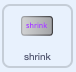
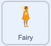

## सिकुड़न मंत्र

<div style="display: flex; flex-wrap: wrap">
<div style="flex-basis: 200px; flex-grow: 1; margin-right: 15px;">
अब जब आप सिकोड़ें बटन पर क्लिक करेंगे तो आपको Fairy सिकुड़ने लगेगी।
</div>
<div>
{:width="300px"}
</div>
</div>

--- task ---

Stage के नीचे Sprite सूची में **shrink** स्प्राइट पर क्लिक करें।

`when this sprite clicked`{:class="block3events"} ब्लॉक जोड़ें:



```blocks3
when this sprite clicked
```

--- /task ---

जब आप सिकोड़ें बटन पर क्लिक करते हैं, तो आप चाहते हैं कि **Fairy** स्प्राइट सिकुड़ जाए।

**shrink** स्प्राइट को `broadcast`{:class="block3events"} एक `message`{:class="block3events"} करने की आवश्यकता है ताकि **Fairy** स्प्राइट को पता चले कि सिकुड़न मंत्र डाला गया है।

--- task ---

एक `broadcast`{:class="block3events"} ब्लॉक जोड़ें:


```blocks3
when this sprite clicked
+ broadcast (message1 v)
```

--- /task ---

--- task ---

`message1`{:class="block3events"} पर क्लिक करें और 'New message' चुनें। नए संदेश को नाम दें < `shrink`।


आपका कोड इस प्रकार दिखना चाहिए:


```blocks3
when this sprite clicked
broadcast (shrink v)
```

--- /task ---

अब जब आप **shrink** बटन पर क्लिक करते हैं, तो Scratch `प्रसारण`{:class="block3events"} `shrink`{:class="block3events"} संदेश प्रसारित करेगा, लेकिन अभी तक कुछ नहीं होगा।

--- task ---

**Fairy** स्प्राइट में कोड जोड़ें जब इसे एक `shrink`{:class="block3events"} संदेश प्राप्त हो तो यह सिकुड जाए:



```blocks3
when I receive [shrink v]
change size by [-10] // negative numbers decrease the size
```

--- /task ---

--- task ---

**परीक्षण:** **fairy** स्प्राइट को सिकोड़ने के लिए **shrink** बटन पर क्लिक करें। इसे आप जितनी बार चाहें उतनी बार करें।

**डिबग:** यदि आपकी **Fairy** स्प्राइट सिकुड़ने के बजाय badhti है, तो एक ऋणात्मक संख्या `-10`बनाने के लिए संख्या `10` के आगे `-` जोड़ें।

--- /task ---

--- task ---

`when the green flag`{:class="block3events"} क्लिक किया जाता है **Fairy** स्प्राइट को सामान्य आकार पर सेट करने के लिए एक स्क्रिप्ट जोड़ें:


```blocks3
when flag clicked
set size to [100] %
```

--- /task ---

जब संदेश `broadcast`{:class="block3events"} वे सभी स्प्राइट्स द्वारा प्राप्त किए जा सकते हैं। जब **Wand** `receives`{:class="block3events"} को `shrink`{:class="block3events"} संदेश प्राप्त होता है, तो इसे `play a sound`{:class="block3sound"} बजाना चाहिए।

--- task ---

**Wand** स्प्राइट और फिर **Sound** टैब पर क्लिक करें।

**Slide Whistle** ध्वनि जोड़ें।

ध्वनि का नाम बदलकर `shrink` कर दें ताकि उसे ढूंढना आसान हो।


--- /task ---

--- task ---

ध्वनि चलाने के लिए एक स्क्रिप्ट जोड़ें:


```blocks3
when I receive [shrink v]
play sound [shrink v] until done

```

--- /task ---

--- task ---

**परीक्षण:** अपने प्रोजेक्ट को चलाने के लिए हरी झंडी पर क्लिक करें। ध्वनि सुनने के लिए **shrink** बटन पर क्लिक करें **Fairy** सिकुड़ते देखें।

--- /task ---

**shrink** बटन `broadcast`{:class="block3events"} करती है एक `shrink`{:class="block3events"} संदेश। दोनों **Fairy** और **Wand** स्प्राइट ने संदेश `received`{:class="block3events"} किया और जवाब दिया।

--- save ---
