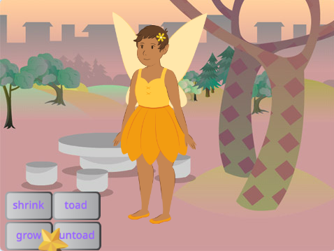
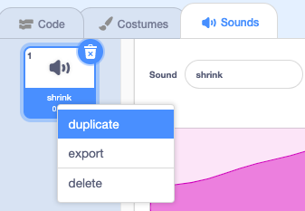

## बढ़ने का मंत्र

<div style="display: flex; flex-wrap: wrap">
<div style="flex-basis: 200px; flex-grow: 1; margin-right: 15px;">
**Fairy** स्प्राइट को सामान्य आकार में वापस करने या एक विशाल परी बनाने के लिए आपको एक बढ़ने के मंत्र की भी आवश्यकता होती है!
</div>
<div>
{:width="300px"}
</div>
</div>

**सलाह:** इस चरण में, आप तीन अलग-अलग स्प्राइट्स में कोड जोड़ेंगे। सुनिश्चित करें कि आपने Stage के नीचे Sprite सूची से सही स्प्राइट का चयन किया है और **Code** टैब पर क्लिक करें।

--- task ---

**grow**> बटन स्प्राइट में एक स्क्रिप्ट जोड़ें ताकि यह एक `grow`{:class="block3events"} संदेश `broadcast`{:class="block3events"} करे:


```blocks3
when this sprite clicked
broadcast (grow v)
```

--- /task ---

--- task ---

**Fairy** स्प्राइट को बड़ा करने के लिए एक स्क्रिप्ट जोड़ें:


```blocks3
when I receive [grow v]
change size by [10] // घनात्मक संख्याएँ आकार को बढ़ाती हैं
```

--- /task ---

आप 'grow' की ध्वनि बनाने के लिए 'shrink' ध्वनि को उलट सकते हैं!

<p style="border-left: solid; border-width:10px; border-color: #0faeb0; background-color: aliceblue; padding: 10px;">
<span style="color: #0faeb0">**पीछे की ओर से चलाए जाने वाले गाने के क्विज़**</span> एक ट्विस्ट के साथ संगीत क्विज़ हैं। ट्रैक उलट जाते हैं, और प्रतियोगियों को मूल गीत का अनुमान लगाना होता है - यह उतना आसान नहीं है जितना लगता है। 
</p>

--- task ---

**Wand** स्प्राइट चुनें और **Sound** टैब पर क्लिक करें।

**shrink** ध्वनि पर राइट-क्लिक करें (या दबाएँ और और होल्ड करें) और **duplicate** का चयन करें




कॉपी को नाम `grow` दें ।

ध्वनि को पीछे की ओर चलाने के लिए **Reverse** आइकन पर क्लिक करें।


--- /task ---

--- task ---

जब `grow`{:class="block3events"} संदेश प्राप्त होता है `grow`{:class="block3sound"} ध्वनि चलाने के लिए **Wand** स्प्राइट में एक स्क्रिप्ट जोड़ें:


```blocks3
when I receive [grow v]
play sound [grow v] until done
```

--- /task ---

--- task ---

**परीक्षण:** **shrink** और **grow** मंत्र बटन पर क्लिक करके जितनी बार आप चाहें उतनी बार आप मंत्र डाल सकते हैं।

--- /task ---

--- save ---

